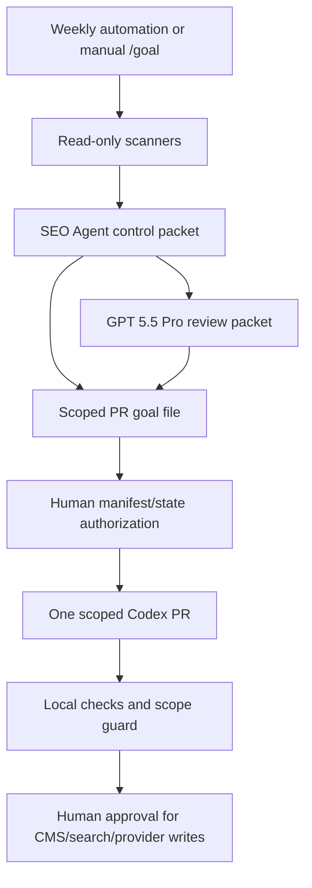
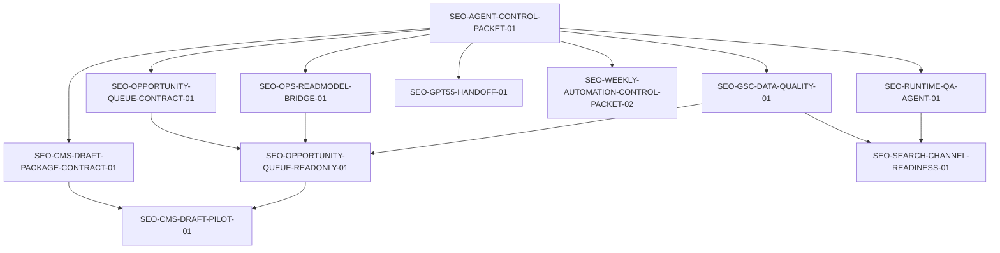

# FermatMind SEO Agent PR Decomposition

Generated: 2026-06-20T03:25:29+08:00

This is a planning-only decomposition for the next FermatMind SEO Agent workstream. It does not implement runtime behavior, does not change CMS or search-provider state, does not update automation TOML, and does not modify PR-train manifest/state files.

## Executive Verdict

The next FermatMind SEO Agent should not become an OpenClaw-style broad-permission autonomous operator first. The safe shape is a gated SEO control plane:

1. Read-only evidence scanners produce bounded artifacts.
2. A control packet classifies every evidence source and action lane.
3. GPT 5.5 Pro reviews strategy/content/claim risk but does not execute.
4. Codex executes one scoped PR at a time only after manifest/state authorization.
5. CMS, Search Channel, schema, hreflang, sitemap, llms, indexing, and provider submissions stay behind explicit human approval.

The current best first implementation path is therefore:

```text
control packet
  -> read-model bridge / runtime QA / GSC data quality
  -> GPT 5.5 review handoff and weekly packet checks
  -> opportunity queue contract
  -> opportunity queue read-only
  -> CMS draft dry-run pilot
  -> Search Channel readiness / approval / live submission gates
```

## Current Repository Truth

- The control packet exists in a redacted local worktree on branch `codex/seo-agent-control-packet-01`, but it is not merged into `main`.
- The control packet files are uncommitted intent-to-add docs under `docs/seo/agent/**`.
- The fap-web `/ops/seo-operations` page is still a shell with mock/static artifact data, not live `seo_intel`.
- The fap-api `seo_intel` area already has read-only dashboard endpoints, GSC storage shape, issue queue services, CMS package commands, and Search Channel Queue services.
- Existing GSC collector behavior is safe-by-default and fixture/dry-run oriented; live GSC API use and writes are not a current assumption.
- The weekly Codex automation is already read-only. It should not be edited until control packet support is merged and separately authorized.
- None of the proposed PR ids in this report are currently authorized in `docs/codex/pr-train.yaml` or `docs/codex/pr-train-state.json`.

## Agent Shape

The agent becomes a control-and-evidence system before it becomes an executor.



## Difference From OpenClaw

The difference is material:

- OpenClaw-style agents optimize for broad tool access and long-running task execution.
- FermatMind SEO Agent must optimize for SEO/CMS correctness, claim safety, content authority, and search-provider risk.
- OpenClaw can treat tools as direct execution capability.
- FermatMind must treat tools as evidence collectors by default, with CMS/search mutation blocked until an exact approval phrase and a narrow scope exist.
- FermatMind should preserve repo truth, CMS authority, PR-train ledgers, and source classification. It should not improvise around missing GSC, CMS, or provider evidence.

## Dependency Graph



## Candidate PRs

| PR id | Status | Repo | Action lane | Recommendation |
| --- | --- | --- | --- | --- |
| `SEO-OPS-READMODEL-BRIDGE-01` | `READY_AFTER_CONTROL_PACKET` | fap-web | `OPS_READMODEL_BRIDGE` | First executable slice after control packet. Bridge dashboard data to a sanitized read model, preserving explicit artifact fallback labels. |
| `SEO-RUNTIME-QA-AGENT-01` | `READY_AFTER_CONTROL_PACKET` | fap-web | `RUNTIME_QA_READONLY` | Add a read-only CLI evidence generator for public runtime SEO checks. Do not add dashboard UI in this PR. |
| `SEO-GSC-DATA-QUALITY-01` | `READY_AFTER_CONTROL_PACKET` | fap-api | `GSC_DATA_QUALITY_READONLY` | Add data-quality gates before any GSC-driven opportunity decisions. |
| `SEO-WEEKLY-AUTOMATION-CONTROL-PACKET-02` | `READY_AFTER_CONTROL_PACKET` | fap-web | `WEEKLY_AUTOMATION_CONTROL_PACKET` | Add checkable weekly packet contract. Do not edit local automation TOML. |
| `SEO-GPT55-HANDOFF-01` | `READY_AFTER_CONTROL_PACKET` | fap-web | `GPT55_REVIEW_HANDOFF` | Make GPT 5.5 Pro review output schema-checkable and non-executing. |
| `SEO-OPPORTUNITY-QUEUE-CONTRACT-01` | `READY_AFTER_CONTROL_PACKET` | fap-api/docs | `OPPORTUNITY_QUEUE_CONTRACT` | Define scoring/input/source contract before implementing a read model. |
| `SEO-OPPORTUNITY-QUEUE-READONLY-01` | `READY_AFTER_GSC_QUALITY` | fap-api | `OPPORTUNITY_QUEUE_READONLY` | Build only after GSC quality and bridge contracts are in place. |
| `SEO-CMS-DRAFT-PACKAGE-CONTRACT-01` | `READY_AFTER_CONTROL_PACKET` | fap-api/docs | `CMS_DRAFT_PACKAGE_CONTRACT` | Define dry-run package contract and claim gates. |
| `SEO-CMS-DRAFT-PILOT-01` | `HOLD_CMS_SAFETY` | fap-api | `CMS_DRAFT_PACKAGE_DRY_RUN` | Hold until package contract, GPT 5.5 content approval, exact package hash, and dry-run approval exist. |
| `SEO-SEARCH-CHANNEL-READINESS-01` | `HOLD_SEARCH_PROVIDER_SAFETY` | fap-api | `SEARCH_CHANNEL_READINESS` | Hold as an execution lane. Only a future readiness/preflight PR is safe before provider calls. |

## Status Catalog

These are the allowed status values for this workstream. Not every status must be used by the first ten candidate PRs.

- `READY_NOW`: executable from the current authorized base with manifest/state authorization.
- `READY_AFTER_CONTROL_PACKET`: executable after `SEO-AGENT-CONTROL-PACKET-01` is merged to `main`, or after the user explicitly authorizes the control-packet branch as the base.
- `READY_AFTER_OPS_BRIDGE`: executable only after the ops read-model bridge has landed.
- `READY_AFTER_RUNTIME_QA`: executable only after public runtime SEO QA evidence exists.
- `READY_AFTER_GSC_QUALITY`: executable only after GSC data-quality gates pass.
- `HOLD_CMS_SAFETY`: held because it could mutate CMS or editorial state without enough contracts and approvals.
- `HOLD_SEARCH_PROVIDER_SAFETY`: held because it could enqueue, approve, or submit to search providers without enough gates and approvals.
- `HOLD_NEEDS_MORE_EVIDENCE`: held because required evidence sources are missing, stale, mock, fixture, or unclassified.

## Recommended First PR

First recommended execution prompt after control packet merge or explicit base-branch authorization:

```text
/goal Proceed with SEO-OPS-READMODEL-BRIDGE-01 using docs/seo/agent/goals/SEO-OPS-READMODEL-BRIDGE-01.goal.md. Authorize adding the PR-train manifest/state entries required for this PR, then execute only that scope from latest main.
```

Why this first:

- It closes the most visible gap between the current ops dashboard and the backend `seo_intel` read model.
- It is still read-only.
- It reduces the chance that later agent decisions are based on local mock/artifact data.
- It does not require CMS writes, GSC live collection, Search Channel enqueue, provider submission, or automation changes.

## Next Five Goal Commands

These should be run only after `SEO-AGENT-CONTROL-PACKET-01` is merged or the user explicitly authorizes using the control packet branch as the base.

```text
/goal Proceed with SEO-RUNTIME-QA-AGENT-01 using docs/seo/agent/goals/SEO-RUNTIME-QA-AGENT-01.goal.md. Authorize manifest/state entries, then implement only the read-only runtime QA evidence generator scope.
```

```text
/goal Proceed with SEO-GSC-DATA-QUALITY-01 using docs/seo/agent/goals/SEO-GSC-DATA-QUALITY-01.goal.md. Authorize fap-api manifest/state entries, then implement only the read-only GSC data-quality gate.
```

```text
/goal Proceed with SEO-GPT55-HANDOFF-01 using docs/seo/agent/goals/SEO-GPT55-HANDOFF-01.goal.md. Authorize manifest/state entries, then implement only the GPT 5.5 review handoff checker and examples.
```

```text
/goal Proceed with SEO-WEEKLY-AUTOMATION-CONTROL-PACKET-02 using docs/seo/agent/goals/SEO-WEEKLY-AUTOMATION-CONTROL-PACKET-02.goal.md. Authorize manifest/state entries, then implement only the weekly packet contract; do not edit automation TOML.
```

```text
/goal Proceed with SEO-OPPORTUNITY-QUEUE-CONTRACT-01 using docs/seo/agent/goals/SEO-OPPORTUNITY-QUEUE-CONTRACT-01.goal.md. Authorize manifest/state entries, then define only the opportunity queue contract; do not build queue execution.
```

## Parallelization

Can run in parallel after control packet approval if they use isolated worktrees and separate PRs:

- `SEO-RUNTIME-QA-AGENT-01`
- `SEO-GSC-DATA-QUALITY-01`
- `SEO-GPT55-HANDOFF-01`
- `SEO-WEEKLY-AUTOMATION-CONTROL-PACKET-02`
- `SEO-CMS-DRAFT-PACKAGE-CONTRACT-01`

Should not run in parallel with dependent consumers:

- `SEO-OPPORTUNITY-QUEUE-READONLY-01` waits for `SEO-GSC-DATA-QUALITY-01`, `SEO-OPPORTUNITY-QUEUE-CONTRACT-01`, and the ops read-model bridge.
- `SEO-CMS-DRAFT-PILOT-01` waits for the CMS package contract and human content/package approval.
- `SEO-SEARCH-CHANNEL-READINESS-01` waits for runtime QA and GSC quality evidence, and live provider execution remains separately held.

## Hold Items

`SEO-OPPORTUNITY-QUEUE-READONLY-01` is not first-wave execution. It must wait until GSC data quality proves the source can support opportunity scoring without fixture/mock leakage.

`SEO-CMS-DRAFT-PILOT-01` is held for CMS safety. Do not let Codex write or rewrite article body content. GPT 5.5 Pro owns content judgment; Codex may validate and import only after exact approval.

`SEO-SEARCH-CHANNEL-READINESS-01` is held for search-provider safety. Readiness/preflight is allowed later, but enqueue, approval, and live submission are separate gates.

## Required Authorizations

Before any implementation PR:

- Authorize adding the relevant PR id to `docs/codex/pr-train.yaml`.
- Authorize initializing the relevant state entry in `docs/codex/pr-train-state.json`.
- Confirm whether the base is merged `main` or the unmerged control-packet branch.

Before automation changes:

- Name the automation id.
- Name the exact local automation config path in the separate authorization. Do not commit that path into repo artifacts.
- Name the merged control-packet SHA.
- Authorize the exact prompt-contract version.

Before CMS writes:

- Name the exact package path and content hash.
- Approve dry-run first.
- Approve draft write separately.
- Keep publish/indexability/search submission out of the draft import PR.

Before Search Channel writes or provider calls:

- Name exact URL(s), channel(s), and environment.
- Approve queue write separately from approval and live submission.
- Keep provider credentials/env changes out of agent PRs unless separately authorized.

## Uncertain Items

- The exact backend API contract consumed by fap-web should be confirmed before `SEO-OPS-READMODEL-BRIDGE-01` consumes live data.
- The GSC table may currently contain fixture, stale, or partial rows. It cannot drive opportunity scoring until `SEO-GSC-DATA-QUALITY-01` passes.
- The weekly automation references a skill/context that must be available from merged repo state before local automation config is changed.
- Search Channel Queue has execution services, but this decomposition treats them as out of scope until readiness gates and exact approvals exist.

## Proposed Manifest Entries

Do not paste these into PR-train files without explicit user authorization. They are included only as planning output.

```yaml
- id: SEO-OPS-READMODEL-BRIDGE-01
  repo: fap-web
  branch: codex/seo-ops-readmodel-bridge-01
  title: "feat(ops): bridge SEO operations dashboard to read model"
  depends_on: [SEO-AGENT-CONTROL-PACKET-01]

- id: SEO-RUNTIME-QA-AGENT-01
  repo: fap-web
  branch: codex/seo-runtime-qa-agent-01
  title: "test(seo): add public runtime SEO QA agent"
  depends_on: [SEO-AGENT-CONTROL-PACKET-01]

- id: SEO-GSC-DATA-QUALITY-01
  repo: fap-api
  branch: codex/seo-gsc-data-quality-01
  title: "test(seo-intel): add GSC daily data quality contract"
  depends_on: [SEO-AGENT-CONTROL-PACKET-01]

- id: SEO-GPT55-HANDOFF-01
  repo: fap-web
  branch: codex/seo-gpt55-handoff-01
  title: "test(seo-agent): add GPT 5.5 review handoff contract"
  depends_on: [SEO-AGENT-CONTROL-PACKET-01]

- id: SEO-WEEKLY-AUTOMATION-CONTROL-PACKET-02
  repo: fap-web
  branch: codex/seo-weekly-automation-control-packet-02
  title: "test(seo-agent): add weekly automation control packet contract"
  depends_on: [SEO-AGENT-CONTROL-PACKET-01, SEO-GPT55-HANDOFF-01]

- id: SEO-OPPORTUNITY-QUEUE-CONTRACT-01
  repo: fap-api
  branch: codex/seo-opportunity-queue-contract-01
  title: "docs(seo-intel): define opportunity queue contract"
  depends_on: [SEO-AGENT-CONTROL-PACKET-01]

- id: SEO-OPPORTUNITY-QUEUE-READONLY-01
  repo: fap-api
  branch: codex/seo-opportunity-queue-readonly-01
  title: "feat(seo-intel): add read-only opportunity queue"
  depends_on: [SEO-GSC-DATA-QUALITY-01, SEO-OPPORTUNITY-QUEUE-CONTRACT-01, SEO-OPS-READMODEL-BRIDGE-01]

- id: SEO-CMS-DRAFT-PACKAGE-CONTRACT-01
  repo: fap-api
  branch: codex/seo-cms-draft-package-contract-01
  title: "docs(cms): define SEO CMS draft package contract"
  depends_on: [SEO-AGENT-CONTROL-PACKET-01]

- id: SEO-CMS-DRAFT-PILOT-01
  repo: fap-api
  branch: codex/seo-cms-draft-pilot-01
  title: "test(cms): pilot SEO CMS draft package dry run"
  depends_on: [SEO-CMS-DRAFT-PACKAGE-CONTRACT-01, SEO-OPPORTUNITY-QUEUE-READONLY-01]

- id: SEO-SEARCH-CHANNEL-READINESS-01
  repo: fap-api
  branch: codex/seo-search-channel-readiness-01
  title: "test(seo-intel): add Search Channel readiness gates"
  depends_on: [SEO-GSC-DATA-QUALITY-01, SEO-RUNTIME-QA-AGENT-01]
```

## Checks For This Planning Package

- JSON parse `docs/seo/agent/evidence/pr_decomposition.json`.
- Verify files are limited to `docs/seo/agent/**`.
- Run `git diff --check`.
