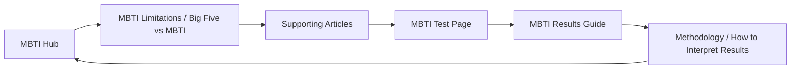
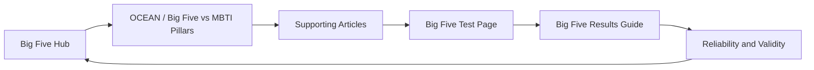
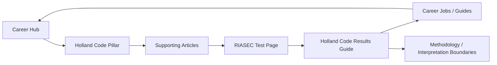
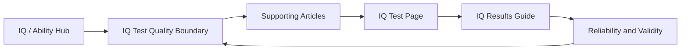
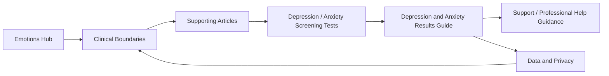

# FermatMind Content Cluster Map

日期：2026-05-27
范围：SEO 内容集群规划，不新增 CMS 正文内容，不新增前端硬编码内容。所有 hub、pillar、article、FAQ、result guide 必须由 CMS/backend authority 创建、审阅和发布后才可进入 sitemap、footer 或页面内链。P0 执行边界以 `docs/seo/fermatmind-site-map-proposal.md` 为准。

## Operating Rules

- 每个集群闭环必须是：hub page -> pillar pages -> supporting articles -> target test page -> result interpretation page -> methodology or boundary page。
- 高风险心理健康和 IQ 页面必须 `review_required=true`。
- 未创建或未审阅页面不得被 footer、header、sitemap、hreflang、测试页稳定链接。
- 文章标题是生产队列，不代表现有页面。
- P0 不生产内容集群正文。P0 只做 allowlist/holdlist、footer/sitemap/root redirect、results/lookup route decision、clinical/depression indexability decision、career/jobs indexability decision 和 404 清理。
- `/results`、`/results/*`、`/science/*`、`/methodology`、`/reliability-validity`、`/refund-policy` 均为 P1 内容建设项，除非只是 route reservation、holdlist 或 CMS ticket。

## 1. MBTI Cluster

| Element | URL or Asset | Authority | Notes |
|---|---|---|---|
| Hub page | `/zh/personality/mbti`, `/en/personality/mbti` | CMS/topic or content_page | 不要在前端硬编码 MBTI 指南正文。 |
| Pillar pages | `/zh/science/mbti-limitations`, `/en/science/mbti-limitations`; `/zh/science/big-five-vs-mbti`, `/en/science/big-five-vs-mbti` | CMS article/content_page | P1。P0 不上线 science 正文页，只保留 holdlist/CMS ticket。 |
| Supporting articles | MBTI 四个字母说明；MBTI 结果会变化吗；INFP 与 INFJ 如何区分；MBTI 能不能用于职业选择；MBTI 与亲密关系沟通 | CMS Article | 每篇文章必须链接 MBTI test 和结果解读。 |
| Target test page | `/zh/tests/mbti-personality-test-16-personality-types`, `/en/tests/mbti-personality-test-16-personality-types` | Backend scale/test API plus frontend renderer | 已存在。P0 仅允许链接 allowlist 目标；results/science links 等 P1 页面真实存在后再加。 |
| Result interpretation page | `/zh/results/mbti`, `/en/results/mbti` | CMS/result-guide authority | P1。先建立目录与边界，再扩展 16 型子页。 |
| Methodology or boundary page | `/zh/methodology`, `/en/methodology`; `/zh/science/how-to-interpret-results`, `/en/science/how-to-interpret-results` | CMS content_page | P1。支撑结果解释和版本选择。 |

Internal linking graph:

First 5 articles to produce:

| Order | Article | User problem | Must link to |
|---:|---|---|---|
| 1 | MBTI 四个字母到底代表什么 | 用户不理解 E/I、S/N、T/F、J/P | MBTI test, MBTI results |
| 2 | MBTI 结果会变化吗 | 用户担心复测结果不一致 | MBTI test, how-to-interpret-results |
| 3 | MBTI 与 Big Five 怎么选 | 用户比较两个模型 | MBTI test, Big Five test, big-five-vs-mbti |
| 4 | MBTI 在职业选择中能用到哪一步 | 用户想用类型选职业 | MBTI test, RIASEC test, career hub |
| 5 | MBTI 不是诊断：类型测试的正确用法 | 用户需要边界和可信解释 | MBTI test, methodology, charter |

Publish order:

1. P0: keep MBTI test linked only to allowlist targets.
2. P1: `/results` hub and `/results/mbti` ready through CMS/backend authority.
3. P1: `/methodology` and `/science/how-to-interpret-results` ready.
4. P1: MBTI hub and first 5 articles publish through CMS.
5. Post-publish: test page adds internal links only after all targets return 200 and are indexable.

## 2. Big Five Cluster

| Element | URL or Asset | Authority | Notes |
|---|---|---|---|
| Hub page | `/zh/personality/big-five`, `/en/personality/big-five` | CMS/topic or content_page | Hub should explain OCEAN without overstating predictive power. |
| Pillar pages | `/zh/science/big-five-vs-mbti`, `/en/science/big-five-vs-mbti`; `/zh/reliability-validity`, `/en/reliability-validity` | CMS content_page/article | Big Five scientific credibility should be evidence-level based, not exaggerated. |
| Supporting articles | OCEAN 五维说明；高神经质是不是坏事；尽责性与学习职业；外倾和社交能力区别；Big Five 分数会变吗 | CMS Article | 每篇链接 Big Five test 和 results page。 |
| Target test page | `/zh/tests/big-five-personality-test-ocean-model`, `/en/tests/big-five-personality-test-ocean-model` | Backend scale/test API plus frontend renderer | 已存在。 |
| Result interpretation page | `/zh/results/big-five`, `/en/results/big-five` | CMS/result-guide authority | P1。解释维度、刻面、高低分、行动建议。 |
| Methodology or boundary page | `/zh/reliability-validity`, `/en/reliability-validity`; `/zh/methodology`, `/en/methodology` | CMS content_page | P1。必须标注证据等级和未验证数据。 |

Internal linking graph:

First 5 articles to produce:

| Order | Article | User problem | Must link to |
|---:|---|---|---|
| 1 | OCEAN 五维分别说明什么 | 用户需要 Big Five 入门 | Big Five test, Big Five results |
| 2 | Big Five 为什么常被认为更稳定 | 用户比较科学性 | Big Five test, reliability-validity |
| 3 | 高神经质是不是坏事 | 用户担心被负面标签 | Big Five results, methodology |
| 4 | 尽责性如何影响学习和职业 | 用户想应用结果 | Big Five test, career hub |
| 5 | Big Five 与 MBTI 怎么选 | 用户在两个测试间犹豫 | Big Five test, MBTI test |

Publish order:

1. P0: keep Big Five test linked only to allowlist targets.
2. P1: `/reliability-validity` and `/methodology` ready.
3. P1: `/results/big-five` ready.
4. P1: Big Five hub and Big Five vs MBTI pillar published.
5. P1/P2: First 5 articles published and linked from hub.

## 3. RIASEC / Career Cluster

| Element | URL or Asset | Authority | Notes |
|---|---|---|---|
| Hub page | `/zh/career`, `/en/career`; future `/zh/career/holland-code`, `/en/career/holland-code` | Existing route plus CMS/topic | Career hub exists; Holland Code pillar should be CMS-authoritative. |
| Pillar pages | `/zh/career/holland-code`, `/en/career/holland-code`; `/zh/career/career-choice`, `/en/career/career-choice`; `/zh/career/job-fit`, `/en/career/job-fit` | CMS content_page/topic | P1/P2。P0 only handles career/jobs sitemap or noindex decision. |
| Supporting articles | RIASEC 六维说明；60 题和 140 题怎么选；职业兴趣和能力不一致怎么办；Holland Code 如何结合职业库；转行如何用 RIASEC 缩小方向 | CMS Article | 每篇链接 RIASEC test 和 career hub。 |
| Target test page | `/zh/tests/holland-career-interest-test-riasec`, `/en/tests/holland-career-interest-test-riasec` | Backend scale/test API plus frontend renderer | 已存在，canonical public IA 必须保留此路径。 |
| Result interpretation page | `/zh/results/holland-code`, `/en/results/holland-code` | CMS/result-guide authority | P1。解释六维、组合码和职业 shortlist。 |
| Methodology or boundary page | `/zh/methodology`, `/en/methodology`; `/zh/science/how-to-interpret-results`, `/en/science/how-to-interpret-results` | CMS content_page | P1。职业推荐不得承诺最适合职业或录用预测。 |

Internal linking graph:

First 5 articles to produce:

| Order | Article | User problem | Must link to |
|---:|---|---|---|
| 1 | RIASEC 六个字母分别代表什么 | 用户需要理解结果维度 | RIASEC test, Holland results |
| 2 | RIASEC 60 题和 140 题怎么选 | 用户不知道版本差异 | RIASEC test |
| 3 | Holland Code 如何和职业库结合 | 用户想把结果转成职业列表 | RIASEC test, career jobs |
| 4 | 职业兴趣和能力不一致怎么办 | 用户结果与现实能力冲突 | RIASEC test, IQ test, career-choice |
| 5 | RIASEC 结果能不能直接决定职业 | 用户需要边界 | RIASEC test, methodology |

Publish order:

1. P0: resolve `/career/jobs` sitemap/indexability.
2. P1: publish `/results/holland-code`.
3. P1: publish `/career/holland-code`.
4. P1/P2: publish first 5 articles.
5. Post-publish: add links from RIASEC test page after targets are live.

## 4. IQ / Cognitive Ability Cluster

| Element | URL or Asset | Authority | Notes |
|---|---|---|---|
| Hub page | `/zh/ability/iq`, `/en/ability/iq` | CMS/topic or content_page | Not P0 unless IQ quality boundary is ready. |
| Pillar pages | `/zh/science/iq-test-quality`, `/en/science/iq-test-quality`; `/zh/ability/reasoning`, `/en/ability/reasoning` | CMS content_page/article | P1 content. P0 only defines IQ review gate and prevents unreviewed sitemap/footer exposure. |
| Supporting articles | 在线 IQ 测试能说明什么；矩阵推理题测什么；IQ 分数误差怎么理解；IQ 与学习能力关系；如何判断 IQ 测试质量 | CMS Article | 每篇链接 IQ test 和 IQ quality boundary。 |
| Target test page | `/zh/tests/iq-test-intelligence-quotient-assessment`, `/en/tests/iq-test-intelligence-quotient-assessment` | Backend scale/test API plus frontend renderer | 已存在；避免 true IQ、certified IQ 等未经证据的表达。 |
| Result interpretation page | `/zh/results/iq`, `/en/results/iq` | CMS/result-guide authority | P1; review_required=true。 |
| Methodology or boundary page | `/zh/science/iq-test-quality`, `/en/science/iq-test-quality`; `/zh/reliability-validity`, `/en/reliability-validity` | CMS content_page | P1; 必须区分在线测评、筛查、专业智力评估。 |

Internal linking graph:

First 5 articles to produce:

| Order | Article | User problem | Must link to |
|---:|---|---|---|
| 1 | 在线 IQ 测试能说明什么，不能说明什么 | 用户需要边界 | IQ test, IQ quality |
| 2 | 矩阵推理题测的是什么 | 用户想理解题型 | IQ test |
| 3 | IQ 分数的误差范围怎么理解 | 用户读不懂分数 | IQ results, IQ quality |
| 4 | IQ 测试为什么不能代表人的全部能力 | 用户担心被标签化 | IQ test, methodology |
| 5 | 如何判断一个 IQ 测试质量是否可靠 | 用户评估可信度 | IQ test, reliability-validity |

Publish order:

1. P0: define IQ review gate; keep unreviewed new IQ boundary/result pages off sitemap/footer.
2. P1: `/science/iq-test-quality` reviewed and live.
3. P1: `/results/iq` reviewed and live.
4. P1/P2: First 5 articles publish after review.
5. P2: Ability hub can launch after enough supporting content exists.

## 5. Depression / Anxiety Boundary Cluster

| Element | URL or Asset | Authority | Notes |
|---|---|---|---|
| Hub page | `/zh/emotions`, `/en/emotions` | CMS/topic or content_page | Do not launch as broad health hub until clinical review and support resources are ready. |
| Pillar pages | `/zh/science/clinical-boundaries`, `/en/science/clinical-boundaries` | CMS content_page | P1 content. P0 only decides clinical/depression indexability and review gate. |
| Supporting articles | 抑郁筛查和诊断区别；焦虑和压力如何区分；结果提示高风险怎么办；情绪筛查隐私；什么时候寻求专业帮助 | CMS Article | 每篇必须链接 clinical boundary and support, not a paid-report CTA. |
| Target test page | `/zh/tests/depression-screening-test-standard-edition`, `/en/tests/depression-screening-test-standard-edition`; `/zh/tests/clinical-depression-anxiety-assessment-professional-edition`, `/en/tests/clinical-depression-anxiety-assessment-professional-edition` | Backend scale/test API plus frontend renderer | Indexability must be decided before sitemap inclusion. |
| Result interpretation page | `/zh/results/depression-anxiety`, `/en/results/depression-anxiety` | CMS/result-guide authority | P1; review_required=true; include non-diagnostic and help-seeking guidance. |
| Methodology or boundary page | `/zh/science/clinical-boundaries`, `/en/science/clinical-boundaries`; `/zh/data-privacy`, `/en/data-privacy` | CMS content_page | P1; privacy and crisis/support routing are part of trust. |

Internal linking graph:

First 5 articles to produce:

| Order | Article | User problem | Must link to |
|---:|---|---|---|
| 1 | 抑郁筛查和诊断有什么区别 | 用户混淆筛查和诊断 | clinical boundary, depression test |
| 2 | 焦虑和压力如何区分 | 用户不知道是否需要进一步求助 | clinical boundary, combined assessment |
| 3 | 测评结果提示高风险时应该怎么办 | 用户需要安全下一步 | support, clinical results |
| 4 | 情绪筛查结果如何保护隐私 | 用户担心数据 | data privacy, privacy policy |
| 5 | 什么时候应该寻求专业帮助 | 用户需要明确边界 | clinical boundary, support |

Publish order:

1. P0: Product/SEO/content decide clinical/depression indexability.
2. P0: pending or noindex pages stay out of sitemap/footer/global nav; indexable requires review_completed=true.
3. P1: `/science/clinical-boundaries` reviewed and live.
4. P1: `/data-privacy` and `/results/depression-anxiety` reviewed and live.
5. P1/P2: Only then publish supporting articles and add high-risk test page internal links.
