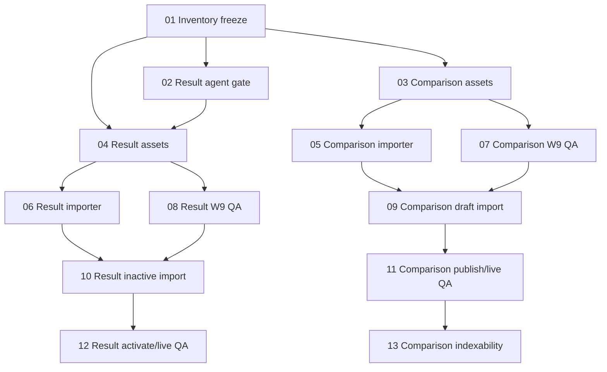

# W1 MBTI English parity inventory freeze handoff

Control: `EN-PARITY-CONTROL-BOOTSTRAP-01`  
Lane: `W1`  
Candidate transition: `not_started → inventory_frozen`  
Inventory package: `EN-PARITY-W1-MBTI-INVENTORY-2026-07-30`

This is a scan/freeze artifact. It contains no final English copy, CMS import, publication, SEO-runtime release, search submission, or private user payload.

## Authority and scan boundary

- fap-web source: clean latest `main` at bootstrap merge `8078c9bf587560727969883dc13c81eb5e5a7365`.
- fap-api evidence: clean read-only `origin/main` snapshot at `a6ee41bf42270a8f85bf2e4c079edef75cf00dfe`; the local backend checkout was not pulled or modified.
- Live evidence time: `2026-07-30T14:30:00Z`, public HTML/API only.
- No authenticated CMS, private attempt/report, order, payment, recovery, or answer-key data was read.
- The master manifest is unchanged. Its protected comparison authority label is preserved in the candidate; current code evidence shows the operational source is the dedicated `MbtiCrossTypeComparisonAuthority` table/read model.

## Frozen counts

| Cohort | Expected | Current English complete | Remaining | Breakdown |
|---|---:|---:|---:|---|
| Cross-type comparisons | 7 | 0 | 7 | 7 missing; 0 draft; 0 partial; 0 unknown |
| Result/report content | 46 | 24 | 22 | 24 complete controls; 1 missing; 0 draft; 20 structurally incomplete; 1 unable to confirm |
| Total | 53 | 24 | 29 | exact source-ledger row count: 53 |

## Seven comparison rows

HTTP columns are `zh page/API` and `en page/API`. All zh rows are `published + approved`, have summary and SEO title/description, and expose only a zh-CN alternate. All English rows are absent, not drafts or route-only shells.

| Slug | Stable authority identity | zh sections/FAQ | zh HTTP | en HTTP | en status | Import blocker |
|---|---|---:|---:|---:|---|---|
| enfp-vs-entp | mbti_cross_type_comparison_authorities:org0:zh-CN:enfp-vs-entp | 8/8 | 200/200 | 404/404 | absent | No English authority row or stored cross-locale translation identity; exact-package production must define deterministic pairing before draft import. |
| entj-vs-intj | mbti_cross_type_comparison_authorities:org0:zh-CN:entj-vs-intj | 6/5 | 200/200 | 404/404 | absent | No English authority row or stored cross-locale translation identity; exact-package production must define deterministic pairing before draft import. |
| estj-vs-entj | mbti_cross_type_comparison_authorities:org0:zh-CN:estj-vs-entj | 8/8 | 200/200 | 404/404 | absent | No English authority row or stored cross-locale translation identity; exact-package production must define deterministic pairing before draft import. |
| infj-vs-infp | mbti_cross_type_comparison_authorities:org0:zh-CN:infj-vs-infp | 6/5 | 200/200 | 404/404 | absent | No English authority row or stored cross-locale translation identity; exact-package production must define deterministic pairing before draft import. |
| intj-vs-intp | mbti_cross_type_comparison_authorities:org0:zh-CN:intj-vs-intp | 6/5 | 200/200 | 404/404 | absent | No English authority row or stored cross-locale translation identity; exact-package production must define deterministic pairing before draft import. |
| isfp-vs-infp | mbti_cross_type_comparison_authorities:org0:zh-CN:isfp-vs-infp | 8/8 | 200/200 | 404/404 | absent | No English authority row or stored cross-locale translation identity; exact-package production must define deterministic pairing before draft import. |
| istj-vs-isfj | mbti_cross_type_comparison_authorities:org0:zh-CN:istj-vs-isfj | 6/5 | 200/200 | 404/404 | absent | No English authority row or stored cross-locale translation identity; exact-package production must define deterministic pairing before draft import. |

The older four 6-section rows use `direct_answer`, `quick_judgment_table`, `easy_misread`, `real_scenario_differences`, `do_not_misjudge`, and `next_reading`. The newer three 8-section rows use `quick_answer`, `why_they_are_confused`, `shared_traits`, `core_difference`, `work_and_learning`, `communication_and_relationships`, `stress_and_growth`, and `misconceptions`.

## Result/report/share/PDF/history matrix

The 46 rows are stable asset families, not type × user instances. Mobile and desktop consume the same backend projection fields; they are not separate content assets.

| Stable identity | Surface | Entitlement | Classification | English presence | Verdict | Owner | Blocker |
|---|---|---|---|---|---|---|---|
| mbti:result:projection:profile | free_preview_and_full_result | all | backend-authoritative reader asset plus runtime type identity | present | complete_control | fap-api | none |
| mbti:result:projection:summary-card | free_preview_and_full_result | all | backend-authoritative reader asset | present | complete_control | fap-api | none |
| mbti:result:projection:dimensions | free_preview_and_full_result | all | backend runtime/computed value with reader explanation | present | complete_control | fap-api | none |
| mbti:result:access-envelope | free_preview_locked_full_and_entitlement | free|preview|locked|full | backend runtime/computed value and access authority | locale-neutral plus localized renderer labels | complete_control | fap-api | none |
| mbti:result:offer-set-and-cta-copy | locked_preview_and_upgrade | preview|locked | backend-authoritative commercial reader asset with renderer fallback labels | runtime_or_renderer_fallback_only; no reviewed English package | structurally_incomplete | fap-api | Requires reviewed English package content and entitlement-safe CTA QA; code fallback is not an English content asset. |
| mbti:result:section:letters_intro | result_section:letters_intro | free_preview_or_full_by_access_policy | CMS public profile content reused as a result projection control | present_control | complete_control | fap-api | none |
| mbti:result:section:overview | result_section:overview | free_preview_or_full_by_access_policy | CMS public profile content reused as a result projection control | present_control | complete_control | fap-api | none |
| mbti:result:section:trait_overview | result_section:trait_overview | free_preview_or_full_by_access_policy | CMS public profile content reused as a result projection control | present_control | complete_control | fap-api | none |
| mbti:result:section:traits.at_difference | result_section:traits.at_difference | free_preview_or_full_by_access_policy | backend-authoritative result content family currently supplied by runtime fallback or locale pack | absent | missing | fap-api | No English CMS section, locale-pack section, or personalization target was found. |
| mbti:result:section:faq | result_section:faq | free_preview_or_full_by_access_policy | CMS public profile content reused as a result projection control | present_control | complete_control | fap-api | none |
| mbti:result:section:traits.why_this_type | result_section:traits.why_this_type | free_preview_or_full_by_access_policy | backend-authoritative result content family currently supplied by runtime fallback or locale pack | runtime_default_or_partial_only | structurally_incomplete | fap-api | Requires reviewed English locale-pack/CMS content; backend code defaults and null bodies do not satisfy editorial parity. |
| mbti:result:section:traits.close_call_axes | result_section:traits.close_call_axes | free_preview_or_full_by_access_policy | backend-authoritative result content family currently supplied by runtime fallback or locale pack | runtime_default_or_partial_only | structurally_incomplete | fap-api | Requires reviewed English locale-pack/CMS content; backend code defaults and null bodies do not satisfy editorial parity. |
| mbti:result:section:traits.adjacent_type_contrast | result_section:traits.adjacent_type_contrast | free_preview_or_full_by_access_policy | backend-authoritative result content family currently supplied by runtime fallback or locale pack | runtime_default_or_partial_only | structurally_incomplete | fap-api | Requires reviewed English locale-pack/CMS content; backend code defaults and null bodies do not satisfy editorial parity. |
| mbti:result:section:traits.decision_style | result_section:traits.decision_style | free_preview_or_full_by_access_policy | backend-authoritative result content family currently supplied by runtime fallback or locale pack | runtime_default_or_partial_only | structurally_incomplete | fap-api | Requires reviewed English locale-pack/CMS content; backend code defaults and null bodies do not satisfy editorial parity. |
| mbti:result:section:career.summary | result_section:career.summary | free_preview_or_full_by_access_policy | CMS public profile content reused as a result projection control | present_control | complete_control | fap-api | none |
| mbti:result:section:career.collaboration_fit | result_section:career.collaboration_fit | free_preview_or_full_by_access_policy | backend-authoritative result content family currently supplied by runtime fallback or locale pack | runtime_default_or_partial_only | structurally_incomplete | fap-api | Requires reviewed English locale-pack/CMS content; backend code defaults and null bodies do not satisfy editorial parity. |
| mbti:result:section:career.work_environment | result_section:career.work_environment | free_preview_or_full_by_access_policy | backend-authoritative result content family currently supplied by runtime fallback or locale pack | runtime_default_or_partial_only | structurally_incomplete | fap-api | Requires reviewed English locale-pack/CMS content; backend code defaults and null bodies do not satisfy editorial parity. |
| mbti:result:section:career.work_experiments | result_section:career.work_experiments | free_preview_or_full_by_access_policy | backend-authoritative result content family currently supplied by runtime fallback or locale pack | runtime_default_or_partial_only | structurally_incomplete | fap-api | Requires reviewed English locale-pack/CMS content; backend code defaults and null bodies do not satisfy editorial parity. |
| mbti:result:section:career.advantages | result_section:career.advantages | free_preview_or_full_by_access_policy | CMS public profile content reused as a result projection control | present_control | complete_control | fap-api | none |
| mbti:result:section:career.weaknesses | result_section:career.weaknesses | free_preview_or_full_by_access_policy | CMS public profile content reused as a result projection control | present_control | complete_control | fap-api | none |
| mbti:result:section:career.preferred_roles | result_section:career.preferred_roles | free_preview_or_full_by_access_policy | CMS public profile content reused as a result projection control | present_control | complete_control | fap-api | none |
| mbti:result:section:career.next_step | result_section:career.next_step | free_preview_or_full_by_access_policy | backend-authoritative result content family currently supplied by runtime fallback or locale pack | runtime_default_or_partial_only | structurally_incomplete | fap-api | Requires reviewed English locale-pack/CMS content; backend code defaults and null bodies do not satisfy editorial parity. |
| mbti:result:section:career.upgrade_suggestions | result_section:career.upgrade_suggestions | free_preview_or_full_by_access_policy | CMS public profile content reused as a result projection control | present_control | complete_control | fap-api | none |
| mbti:result:section:growth.summary | result_section:growth.summary | free_preview_or_full_by_access_policy | CMS public profile content reused as a result projection control | present_control | complete_control | fap-api | none |
| mbti:result:section:growth.stability_confidence | result_section:growth.stability_confidence | free_preview_or_full_by_access_policy | backend-authoritative result content family currently supplied by runtime fallback or locale pack | runtime_default_or_partial_only | structurally_incomplete | fap-api | Requires reviewed English locale-pack/CMS content; backend code defaults and null bodies do not satisfy editorial parity. |
| mbti:result:section:growth.next_actions | result_section:growth.next_actions | free_preview_or_full_by_access_policy | backend-authoritative result content family currently supplied by runtime fallback or locale pack | runtime_default_or_partial_only | structurally_incomplete | fap-api | Requires reviewed English locale-pack/CMS content; backend code defaults and null bodies do not satisfy editorial parity. |
| mbti:result:section:growth.weekly_experiments | result_section:growth.weekly_experiments | free_preview_or_full_by_access_policy | backend-authoritative result content family currently supplied by runtime fallback or locale pack | runtime_default_or_partial_only | structurally_incomplete | fap-api | Requires reviewed English locale-pack/CMS content; backend code defaults and null bodies do not satisfy editorial parity. |
| mbti:result:section:growth.strengths | result_section:growth.strengths | free_preview_or_full_by_access_policy | CMS public profile content reused as a result projection control | present_control | complete_control | fap-api | none |
| mbti:result:section:growth.weaknesses | result_section:growth.weaknesses | free_preview_or_full_by_access_policy | CMS public profile content reused as a result projection control | present_control | complete_control | fap-api | none |
| mbti:result:section:growth.stress_recovery | result_section:growth.stress_recovery | free_preview_or_full_by_access_policy | backend-authoritative result content family currently supplied by runtime fallback or locale pack | runtime_default_or_partial_only | structurally_incomplete | fap-api | Requires reviewed English locale-pack/CMS content; backend code defaults and null bodies do not satisfy editorial parity. |
| mbti:result:section:growth.watchouts | result_section:growth.watchouts | free_preview_or_full_by_access_policy | backend-authoritative result content family currently supplied by runtime fallback or locale pack | runtime_default_or_partial_only | structurally_incomplete | fap-api | Requires reviewed English locale-pack/CMS content; backend code defaults and null bodies do not satisfy editorial parity. |
| mbti:result:section:growth.motivators | result_section:growth.motivators | premium_full | backend-authoritative result content family currently supplied by runtime fallback or locale pack | runtime_default_or_partial_only | structurally_incomplete | fap-api | Requires reviewed English locale-pack/CMS content; backend code defaults and null bodies do not satisfy editorial parity. |
| mbti:result:section:growth.drainers | result_section:growth.drainers | premium_full | backend-authoritative result content family currently supplied by runtime fallback or locale pack | runtime_default_or_partial_only | structurally_incomplete | fap-api | Requires reviewed English locale-pack/CMS content; backend code defaults and null bodies do not satisfy editorial parity. |
| mbti:result:section:relationships.summary | result_section:relationships.summary | free_preview_or_full_by_access_policy | CMS public profile content reused as a result projection control | present_control | complete_control | fap-api | none |
| mbti:result:section:relationships.strengths | result_section:relationships.strengths | free_preview_or_full_by_access_policy | CMS public profile content reused as a result projection control | present_control | complete_control | fap-api | none |
| mbti:result:section:relationships.weaknesses | result_section:relationships.weaknesses | free_preview_or_full_by_access_policy | CMS public profile content reused as a result projection control | present_control | complete_control | fap-api | none |
| mbti:result:section:relationships.communication_style | result_section:relationships.communication_style | free_preview_or_full_by_access_policy | backend-authoritative result content family currently supplied by runtime fallback or locale pack | runtime_default_or_partial_only | structurally_incomplete | fap-api | Requires reviewed English locale-pack/CMS content; backend code defaults and null bodies do not satisfy editorial parity. |
| mbti:result:section:relationships.try_this_week | result_section:relationships.try_this_week | free_preview_or_full_by_access_policy | backend-authoritative result content family currently supplied by runtime fallback or locale pack | runtime_default_or_partial_only | structurally_incomplete | fap-api | Requires reviewed English locale-pack/CMS content; backend code defaults and null bodies do not satisfy editorial parity. |
| mbti:result:section:relationships.rel_advantages | result_section:relationships.rel_advantages | premium_full | backend-authoritative result content family currently supplied by runtime fallback or locale pack | runtime_default_or_partial_only | structurally_incomplete | fap-api | Requires reviewed English locale-pack/CMS content; backend code defaults and null bodies do not satisfy editorial parity. |
| mbti:result:section:relationships.rel_risks | result_section:relationships.rel_risks | premium_full | backend-authoritative result content family currently supplied by runtime fallback or locale pack | runtime_default_or_partial_only | structurally_incomplete | fap-api | Requires reviewed English locale-pack/CMS content; backend code defaults and null bodies do not satisfy editorial parity. |
| mbti:result:share:public-summary-projection | share_public_summary | public_summary_only | backend-authoritative public-summary projection | present_by_contract | complete_control | fap-api | none |
| mbti:result:pdf:reader-content | pdf_reader | entitled_report | backend-authoritative private report projection plus locale-bound PDF labels | code fallback present; private rendered payload unconfirmed | unable_to_confirm | fap-api | No production private attempt/report was used. Validate with a synthetic or approved fixture after exact package freeze. |
| mbti:result:history-account-reentry-labels | history_and_account_reentry | authenticated_owner | frontend renderer label plus backend report-access action | present | complete_control | fap-web | none |
| mbti:result:renderer-module-and-cta-labels | result_module_titles_and_cta_labels | all | frontend renderer label | present | complete_control | fap-web | none |
| mbti:result:lifecycle-state-labels | processing_empty_error_expired_access_denied | all | frontend renderer label driven by backend state | present | complete_control | fap-web | none |
| mbti:result:share-renderer-and-unavailable-labels | share_card_unavailable_and_expired_states | public_summary_only | frontend renderer label | present | complete_control | fap-web | none |

### Result inventory interpretation

- Complete controls (24): profile, summary card, dimensions, access envelope; 15 existing CMS-backed English section controls; share public-summary; history labels; result renderer labels; lifecycle labels; share renderer labels.
- Missing (1): `traits.at_difference`.
- Structurally incomplete (20): offer/CTA plus 19 canonical sections that currently depend on runtime English defaults, null bodies, or a zh-CN-only report content pack.
- Draft (0): no English result content-pack draft authority was found.
- Unable to confirm (1): PDF reader content. Code has English labels/fallback mappings, but no production private report was used; lawful synthetic-fixture QA is required.
- Existing 32 public MBTI A/T profiles are evidence controls and must not be regenerated.

## Chinese leakage and claim boundary

- No reader-visible Chinese leakage was confirmed in the reviewed English public A/T sample or code-localized renderer labels.
- The seven English comparison routes are 404, so they cannot currently leak Chinese through an English reader surface.
- Private report/PDF leakage remains unknown until synthetic-fixture W9 QA; this is not treated as complete.
- No confirmed claim-boundary violation was found in the reviewed sources. Future English assets must remain preference/tendency/self-understanding language and must not claim diagnosis, fixed identity, hiring suitability, official validation, or guaranteed career/relationship outcomes.
- Share is limited to the backend public-summary projection. Private report content must never be copied to public personality pages.

## Evidence and limitations

Primary evidence:

- fap-api `backend/app/Models/MbtiCrossTypeComparisonAuthority.php`
- fap-api `backend/app/Services/Mbti64CrossTypeComparisonPublicReadModel.php`
- fap-api `backend/docs/seo/mbti-comparison-authority-train-45-53-closeout-2026-07-28.md`
- fap-api `backend/app/Services/MbtiCanonicalSectionRegistry.php`
- fap-api `backend/app/Services/MbtiPublicProjectionService.php`
- fap-api `backend/app/Services/MbtiResultPersonalizationService.php`
- fap-api `backend/app/Services/Pdf/Mbti/MbtiPdfPayloadBuilder.php`
- fap-web `components/result/ResultClient.tsx`, `components/result/RichResultReport.tsx`, `components/result/MbtiShareSummaryCard.tsx`
- fap-web `lib/i18n/locales/en.ts` and `lib/i18n/locales/zh.ts`
- Seven read-only public page/API pairs summarized in `source_ledger.json`

Limitations:

- No lawful authenticated CMS read was available; publication/revision evidence comes from the public projection and backend closeout/code.
- No private report, entitlement, share token, or PDF response was sampled.
- A high-concurrency broad variant probe timed out and is explicitly excluded from inventory conclusions.

## Candidate assessment

The inventory can freeze: both registered cohorts have integer counts, every one of the 53 rows is unique and mapped to a registered cohort, and `expected = current + remaining` holds. The candidate proposes only `not_started → inventory_frozen`. All seven permissions remain false.

## PR dependency DAG and order



External gates are not PRs: CONTROL exact-SHA approval before each import/publication, and human post-import editorial approval before publish/activation. Recommended execution order is 01; then 02/03 in parallel, 04 after 02; 05/07 after 03; 06/08 after 04; 09 and 10 after their importer + W9 gates; 11 and 12 after separate editorial approvals; 13 last.

For fap-api, the read-only GitHub branch-protection endpoint reported that `main` is not currently protected. The backend check lists below therefore name every applicable repository-policy CI job from the current `ci.yml` (`hygiene`, `supply-chain`, `content-pack-build-validate`, `verify-mbti-legacy`, `verify-mbti-v2`, `verify-staging-parity`, and `verify-bigfive`); they must all pass even though GitHub does not currently enforce them as branch-protection contexts.

## Candidate PR decisions

- Suggested PRs: **13**, each one repository and one scope.
- Frontend API adapter/renderer consumption repair: **NOT_REQUIRED now**. Current mobile/desktop share the same canonical projection and English renderer labels exist. Open a separate repair PR only if package QA proves a concrete unsupported field or render variant.
- Editorial approval: **NOT_REQUIRED as a code PR**. It is an external, separately hashed human CONTROL gate tied to the exact frozen package SHA. Do not encode approval in a producer-authored report.
- Result sitemap/llms/indexability/search release: **NOT_REQUIRED and prohibited**. Result/report/history/share-private surfaces are private and must never enter discoverability surfaces.
- Comparison search submission as its own PR: **NOT_REQUIRED now**. If explicitly approved after indexability/live QA, store the controlled receipt with the indexability scope or create a later operations-only scope; never submit during content/publish PRs.
- Separate mobile and desktop content PRs: **NOT_REQUIRED** because both consume the same authority fields.

## Complete PR execution map

### 1. EN-PARITY-W1-MBTI-INVENTORY-01

- exact_title: `EN-PARITY-W1-MBTI-INVENTORY-01: freeze MBTI English parity inventory`
- repository: `fap-web`
- scope: Commit only the accepted W1 inventory package and control handoff candidate; no content generation or runtime behavior.
- likely_changed_files: `generated/en-content-parity/W1-mbti/**`, `docs/codex/pr-train.yaml`, `docs/codex/pr-train-state.json`
- explicitly_excluded_files: `app/**`, `components/**`, `lib/**`, `docs/seo/generated/en-content-parity-control-master.v1.json`, `fap-api/**`
- authority_owner: W1 producer / CONTROL accepts candidate
- depends_on: none
- input_artifact_sha_requirement: Current master-manifest SHA plus the package SHA in sha256_manifest.json.
- local_checks:
  - `node scripts/seo/validate-en-content-parity-control.mjs --artifact generated/en-content-parity/W1-mbti/scope_manifest.json`
  - `node scripts/seo/validate-en-content-parity-control.mjs --artifact generated/en-content-parity/W1-mbti/master_manifest_patch.candidate.json`
  - `pnpm exec vitest run tests/contracts/en-content-parity-control-master.contract.test.ts --reporter=dot`
  - `git diff --check`
- required_GitHub_checks: `build`, `contracts`, `verify-big5-contract-freeze`, `verify-enneagram-contract-freeze`
- merge_policy: Squash only after CONTROL accepts the candidate, scope is package-only, and all required checks pass.
- stop_conditions: master manifest changed directly; package SHA mismatch; counts no longer reconcile; scope leaves W1 output/control metadata
- repository_rule_impact: No runtime/content authority/public exposure change; repository-rule update is not required.

Exact proposed `docs/codex/pr-train.yaml` entry:

```yaml
  - id: EN-PARITY-W1-MBTI-INVENTORY-01
    repo: fap-web
    depends_on: []
    branch: codex/en-parity-w1-mbti-inventory-01
    base: main
    title: "EN-PARITY-W1-MBTI-INVENTORY-01: freeze MBTI English parity inventory"
    status: proposed
    scope:
      - "Commit only the accepted W1 inventory package and control handoff candidate; no content generation or runtime behavior."
    required_local_checks:
      - "node scripts/seo/validate-en-content-parity-control.mjs --artifact generated/en-content-parity/W1-mbti/scope_manifest.json"
      - "node scripts/seo/validate-en-content-parity-control.mjs --artifact generated/en-content-parity/W1-mbti/master_manifest_patch.candidate.json"
      - "pnpm exec vitest run tests/contracts/en-content-parity-control-master.contract.test.ts --reporter=dot"
      - "git diff --check"
    merge_policy:
      mode: github_checks_required
      github_checks_required: true
      required_github_checks: [build, contracts, verify-big5-contract-freeze, verify-enneagram-contract-freeze]
```

Exact proposed `docs/codex/pr-train-state.json` initial member value (key: `EN-PARITY-W1-MBTI-INVENTORY-01`):

```json
{
  "id": "EN-PARITY-W1-MBTI-INVENTORY-01",
  "repo": "fap-web",
  "title": "EN-PARITY-W1-MBTI-INVENTORY-01: freeze MBTI English parity inventory",
  "base": "main",
  "branch": "codex/en-parity-w1-mbti-inventory-01",
  "depends_on": [],
  "status": "proposed",
  "commit_sha": null,
  "pr_url": null,
  "checks": {},
  "failure_reason": null,
  "merged_at": null,
  "remote_branch_deleted": false,
  "local_cleanup_executed": false
}
```

Follow-up execution prompt:

> /goal Execute EN-PARITY-W1-MBTI-INVENTORY-01 end to end from latest fap-web main. Exact title: "EN-PARITY-W1-MBTI-INVENTORY-01: freeze MBTI English parity inventory". Scope: Commit only the accepted W1 inventory package and control handoff candidate; no content generation or runtime behavior. Touch only: generated/en-content-parity/W1-mbti/**, docs/codex/pr-train.yaml, docs/codex/pr-train-state.json. Exclude: app/**, components/**, lib/**, docs/seo/generated/en-content-parity-control-master.v1.json, fap-api/**. Dependencies: none. Input SHA requirement: Current master-manifest SHA plus the package SHA in sha256_manifest.json. Use the proposed manifest/state entries from W1 handoff, run every listed local check, follow repository heavy-process guards, open exactly one scoped PR, wait for required GitHub checks, merge only when policy permits, then clean up and revalidate. Stop on: master manifest changed directly; package SHA mismatch; counts no longer reconcile; scope leaves W1 output/control metadata.

### 2. EN-PARITY-W1-MBTI-RESULT-AGENT-01

- exact_title: `EN-PARITY-W1-MBTI-RESULT-AGENT-01: add MBTI result-page content agent gate`
- repository: `fap-web`
- scope: Add the missing MBTI result-page agent runbook, inventory schema, privacy/claim gates, validator, and focused contracts.
- likely_changed_files: `docs/result-page-agents/mbti/**`, `scripts/result-page-agents/validate-mbti-result-content.mjs`, `tests/contracts/mbti-result-content-agent.contract.test.ts`, `docs/codex/pr-train.yaml`, `docs/codex/pr-train-state.json`
- explicitly_excluded_files: `components/result/**`, `lib/api/**`, `app/**`, `final English content`, `CMS/import/publish code`
- authority_owner: fap-web governance; fap-api remains content authority
- depends_on: `EN-PARITY-W1-MBTI-INVENTORY-01`
- input_artifact_sha_requirement: Accepted W1 inventory package SHA.
- local_checks:
  - `node scripts/result-page-agents/validate-mbti-result-content.mjs --inventory <accepted-W1-inventory>`
  - `pnpm exec vitest run tests/contracts/mbti-result-content-agent.contract.test.ts --reporter=dot`
  - `git diff --check`
- required_GitHub_checks: `build`, `contracts`, `verify-big5-contract-freeze`, `verify-enneagram-contract-freeze`
- merge_policy: Squash after focused contracts and all required checks pass.
- stop_conditions: validator reads private payloads; schema includes SEO/private/internal fields; runtime renderer changes enter scope
- repository_rule_impact: Documents existing authority and privacy rules; no runtime authority change.

Exact proposed `docs/codex/pr-train.yaml` entry:

```yaml
  - id: EN-PARITY-W1-MBTI-RESULT-AGENT-01
    repo: fap-web
    depends_on: [EN-PARITY-W1-MBTI-INVENTORY-01]
    branch: codex/en-parity-w1-mbti-result-agent-01
    base: main
    title: "EN-PARITY-W1-MBTI-RESULT-AGENT-01: add MBTI result-page content agent gate"
    status: proposed
    scope:
      - "Add the missing MBTI result-page agent runbook, inventory schema, privacy/claim gates, validator, and focused contracts."
    required_local_checks:
      - "node scripts/result-page-agents/validate-mbti-result-content.mjs --inventory <accepted-W1-inventory>"
      - "pnpm exec vitest run tests/contracts/mbti-result-content-agent.contract.test.ts --reporter=dot"
      - "git diff --check"
    merge_policy:
      mode: github_checks_required
      github_checks_required: true
      required_github_checks: [build, contracts, verify-big5-contract-freeze, verify-enneagram-contract-freeze]
```

Exact proposed `docs/codex/pr-train-state.json` initial member value (key: `EN-PARITY-W1-MBTI-RESULT-AGENT-01`):

```json
{
  "id": "EN-PARITY-W1-MBTI-RESULT-AGENT-01",
  "repo": "fap-web",
  "title": "EN-PARITY-W1-MBTI-RESULT-AGENT-01: add MBTI result-page content agent gate",
  "base": "main",
  "branch": "codex/en-parity-w1-mbti-result-agent-01",
  "depends_on": [
    "EN-PARITY-W1-MBTI-INVENTORY-01"
  ],
  "status": "proposed",
  "commit_sha": null,
  "pr_url": null,
  "checks": {},
  "failure_reason": null,
  "merged_at": null,
  "remote_branch_deleted": false,
  "local_cleanup_executed": false
}
```

Follow-up execution prompt:

> /goal Execute EN-PARITY-W1-MBTI-RESULT-AGENT-01 end to end from latest fap-web main. Exact title: "EN-PARITY-W1-MBTI-RESULT-AGENT-01: add MBTI result-page content agent gate". Scope: Add the missing MBTI result-page agent runbook, inventory schema, privacy/claim gates, validator, and focused contracts. Touch only: docs/result-page-agents/mbti/**, scripts/result-page-agents/validate-mbti-result-content.mjs, tests/contracts/mbti-result-content-agent.contract.test.ts, docs/codex/pr-train.yaml, docs/codex/pr-train-state.json. Exclude: components/result/**, lib/api/**, app/**, final English content, CMS/import/publish code. Dependencies: EN-PARITY-W1-MBTI-INVENTORY-01. Input SHA requirement: Accepted W1 inventory package SHA. Use the proposed manifest/state entries from W1 handoff, run every listed local check, follow repository heavy-process guards, open exactly one scoped PR, wait for required GitHub checks, merge only when policy permits, then clean up and revalidate. Stop on: validator reads private payloads; schema includes SEO/private/internal fields; runtime renderer changes enter scope.

### 3. EN-PARITY-W1-MBTI-COMPARISON-ASSETS-01

- exact_title: `EN-PARITY-W1-MBTI-COMPARISON-ASSETS-01: produce seven English comparison assets`
- repository: `fap-api`
- scope: Produce exactly seven unpublished English comparison content assets as a frozen package; no import or publication.
- likely_changed_files: `backend/content_assets/en-content-parity/W1-mbti/comparisons/**`, `backend/tests/Feature/ContentAssets/MbtiComparisonEnglishPackageTest.php`, `docs/codex/pr-train.yaml`, `docs/codex/pr-train-state.json`
- explicitly_excluded_files: `database writes`, `CMS revisions`, `public API runtime`, `sitemap/llms`, `result/report content`, `fap-web/**`
- authority_owner: fap-api comparison content authority
- depends_on: `EN-PARITY-W1-MBTI-INVENTORY-01`
- input_artifact_sha_requirement: Accepted W1 inventory SHA; output must produce one new immutable comparison package SHA.
- local_checks:
  - `php artisan test --filter=MbtiComparisonEnglishPackageTest`
  - `composer lint (or repository-equivalent focused lint)`
  - `git diff --check`
- required_GitHub_checks: `hygiene`, `supply-chain`, `content-pack-build-validate`, `verify-mbti-legacy`, `verify-mbti-v2`, `verify-staging-parity`, `verify-bigfive`
- merge_policy: Squash only after package validates at row count 7; package_frozen is a separate CONTROL transition and no CMS write occurs.
- stop_conditions: asset set differs from seven slugs; claims exceed MBTI boundary; translation identity unresolved; import/publish code enters scope
- repository_rule_impact: Baseline package only; backend remains authority and no runtime/public exposure changes.

Exact proposed `docs/codex/pr-train.yaml` entry:

```yaml
  - id: EN-PARITY-W1-MBTI-COMPARISON-ASSETS-01
    repo: fap-api
    depends_on: [EN-PARITY-W1-MBTI-INVENTORY-01]
    branch: codex/en-parity-w1-mbti-comparison-assets-01
    base: main
    title: "EN-PARITY-W1-MBTI-COMPARISON-ASSETS-01: produce seven English comparison assets"
    status: proposed
    scope:
      - "Produce exactly seven unpublished English comparison content assets as a frozen package; no import or publication."
    required_local_checks:
      - "php artisan test --filter=MbtiComparisonEnglishPackageTest"
      - "composer lint (or repository-equivalent focused lint)"
      - "git diff --check"
    merge_policy:
      mode: github_checks_required
      github_checks_required: true
      required_github_checks: [hygiene, supply-chain, content-pack-build-validate, verify-mbti-legacy, verify-mbti-v2, verify-staging-parity, verify-bigfive]
```

Exact proposed `docs/codex/pr-train-state.json` initial member value (key: `EN-PARITY-W1-MBTI-COMPARISON-ASSETS-01`):

```json
{
  "id": "EN-PARITY-W1-MBTI-COMPARISON-ASSETS-01",
  "repo": "fap-api",
  "title": "EN-PARITY-W1-MBTI-COMPARISON-ASSETS-01: produce seven English comparison assets",
  "base": "main",
  "branch": "codex/en-parity-w1-mbti-comparison-assets-01",
  "depends_on": [
    "EN-PARITY-W1-MBTI-INVENTORY-01"
  ],
  "status": "proposed",
  "commit_sha": null,
  "pr_url": null,
  "checks": {},
  "failure_reason": null,
  "merged_at": null,
  "remote_branch_deleted": false,
  "local_cleanup_executed": false
}
```

Follow-up execution prompt:

> /goal Execute EN-PARITY-W1-MBTI-COMPARISON-ASSETS-01 end to end from latest fap-api main. Exact title: "EN-PARITY-W1-MBTI-COMPARISON-ASSETS-01: produce seven English comparison assets". Scope: Produce exactly seven unpublished English comparison content assets as a frozen package; no import or publication. Touch only: backend/content_assets/en-content-parity/W1-mbti/comparisons/**, backend/tests/Feature/ContentAssets/MbtiComparisonEnglishPackageTest.php, docs/codex/pr-train.yaml, docs/codex/pr-train-state.json. Exclude: database writes, CMS revisions, public API runtime, sitemap/llms, result/report content, fap-web/**. Dependencies: EN-PARITY-W1-MBTI-INVENTORY-01. Input SHA requirement: Accepted W1 inventory SHA; output must produce one new immutable comparison package SHA. Use the proposed manifest/state entries from W1 handoff, run every listed local check, follow repository heavy-process guards, open exactly one scoped PR, wait for required GitHub checks, merge only when policy permits, then clean up and revalidate. Stop on: asset set differs from seven slugs; claims exceed MBTI boundary; translation identity unresolved; import/publish code enters scope.

### 4. EN-PARITY-W1-MBTI-RESULT-ASSETS-01

- exact_title: `EN-PARITY-W1-MBTI-RESULT-ASSETS-01: produce MBTI English result content assets`
- repository: `fap-api`
- scope: Produce the 22 remaining English result/report asset families against the frozen 46-row inventory; preserve 24 completed controls.
- likely_changed_files: `backend/content_assets/en-content-parity/W1-mbti/result-content/**`, `backend/tests/Feature/ContentAssets/MbtiResultEnglishPackageTest.php`, `docs/codex/pr-train.yaml`, `docs/codex/pr-train-state.json`
- explicitly_excluded_files: `private attempts/reports`, `orders/payments`, `public personality copy`, `CMS import`, `PDF/live rendering`, `fap-web/**`
- authority_owner: fap-api MBTI result/report content authority
- depends_on: `EN-PARITY-W1-MBTI-INVENTORY-01`, `EN-PARITY-W1-MBTI-RESULT-AGENT-01`
- input_artifact_sha_requirement: Accepted W1 inventory SHA and accepted result-agent contract SHA; output must produce a distinct immutable result package SHA.
- local_checks:
  - `php artisan test --filter=MbtiResultEnglishPackageTest`
  - `bash scripts/verify_mbti.sh (subject to heavy-process guard)`
  - `git diff --check`
- required_GitHub_checks: `hygiene`, `supply-chain`, `content-pack-build-validate`, `verify-mbti-legacy`, `verify-mbti-v2`, `verify-staging-parity`, `verify-bigfive`
- merge_policy: Squash only after the exact 46-row contract reconciles as 46 expected and 46 package/control-covered; no CMS write.
- stop_conditions: private/user-specific data appears; completed public A/T profiles are regenerated; entitlement fields leak; claim boundary fails
- repository_rule_impact: Baseline content package only; result authority stays backend and public exposure does not change.

Exact proposed `docs/codex/pr-train.yaml` entry:

```yaml
  - id: EN-PARITY-W1-MBTI-RESULT-ASSETS-01
    repo: fap-api
    depends_on: [EN-PARITY-W1-MBTI-INVENTORY-01, EN-PARITY-W1-MBTI-RESULT-AGENT-01]
    branch: codex/en-parity-w1-mbti-result-assets-01
    base: main
    title: "EN-PARITY-W1-MBTI-RESULT-ASSETS-01: produce MBTI English result content assets"
    status: proposed
    scope:
      - "Produce the 22 remaining English result/report asset families against the frozen 46-row inventory; preserve 24 completed controls."
    required_local_checks:
      - "php artisan test --filter=MbtiResultEnglishPackageTest"
      - "bash scripts/verify_mbti.sh (subject to heavy-process guard)"
      - "git diff --check"
    merge_policy:
      mode: github_checks_required
      github_checks_required: true
      required_github_checks: [hygiene, supply-chain, content-pack-build-validate, verify-mbti-legacy, verify-mbti-v2, verify-staging-parity, verify-bigfive]
```

Exact proposed `docs/codex/pr-train-state.json` initial member value (key: `EN-PARITY-W1-MBTI-RESULT-ASSETS-01`):

```json
{
  "id": "EN-PARITY-W1-MBTI-RESULT-ASSETS-01",
  "repo": "fap-api",
  "title": "EN-PARITY-W1-MBTI-RESULT-ASSETS-01: produce MBTI English result content assets",
  "base": "main",
  "branch": "codex/en-parity-w1-mbti-result-assets-01",
  "depends_on": [
    "EN-PARITY-W1-MBTI-INVENTORY-01",
    "EN-PARITY-W1-MBTI-RESULT-AGENT-01"
  ],
  "status": "proposed",
  "commit_sha": null,
  "pr_url": null,
  "checks": {},
  "failure_reason": null,
  "merged_at": null,
  "remote_branch_deleted": false,
  "local_cleanup_executed": false
}
```

Follow-up execution prompt:

> /goal Execute EN-PARITY-W1-MBTI-RESULT-ASSETS-01 end to end from latest fap-api main. Exact title: "EN-PARITY-W1-MBTI-RESULT-ASSETS-01: produce MBTI English result content assets". Scope: Produce the 22 remaining English result/report asset families against the frozen 46-row inventory; preserve 24 completed controls. Touch only: backend/content_assets/en-content-parity/W1-mbti/result-content/**, backend/tests/Feature/ContentAssets/MbtiResultEnglishPackageTest.php, docs/codex/pr-train.yaml, docs/codex/pr-train-state.json. Exclude: private attempts/reports, orders/payments, public personality copy, CMS import, PDF/live rendering, fap-web/**. Dependencies: EN-PARITY-W1-MBTI-INVENTORY-01, EN-PARITY-W1-MBTI-RESULT-AGENT-01. Input SHA requirement: Accepted W1 inventory SHA and accepted result-agent contract SHA; output must produce a distinct immutable result package SHA. Use the proposed manifest/state entries from W1 handoff, run every listed local check, follow repository heavy-process guards, open exactly one scoped PR, wait for required GitHub checks, merge only when policy permits, then clean up and revalidate. Stop on: private/user-specific data appears; completed public A/T profiles are regenerated; entitlement fields leak; claim boundary fails.

### 5. EN-PARITY-W1-MBTI-COMPARISON-IMPORTER-01

- exact_title: `EN-PARITY-W1-MBTI-COMPARISON-IMPORTER-01: add exact-package comparison dry-run importer`
- repository: `fap-api`
- scope: Add schema validation and dry-run-only exact-SHA importer for the seven comparison assets, including deterministic translation pairing.
- likely_changed_files: `backend/app/Console/Commands/ImportMbtiComparisonEnglishPackage.php`, `backend/app/Services/ContentImport/MbtiComparisonEnglishPackageImporter.php`, `backend/tests/Feature/ContentImport/MbtiComparisonEnglishPackageImporterTest.php`, `backend/AGENTS.md`, `docs/codex/pr-train.yaml`, `docs/codex/pr-train-state.json`
- explicitly_excluded_files: `production execution receipt`, `draft import`, `promotion/publish`, `sitemap/llms`, `result assets`
- authority_owner: fap-api comparison authority
- depends_on: `EN-PARITY-W1-MBTI-COMPARISON-ASSETS-01`
- input_artifact_sha_requirement: Exact frozen comparison package SHA; command must reject any other SHA and default to dry-run.
- local_checks:
  - `php artisan test --filter=MbtiComparisonEnglishPackageImporterTest`
  - `php artisan route:list --path=api --except-vendor`
  - `git diff --check`
- required_GitHub_checks: `hygiene`, `supply-chain`, `content-pack-build-validate`, `verify-mbti-legacy`, `verify-mbti-v2`, `verify-staging-parity`, `verify-bigfive`
- merge_policy: Squash after dry-run proves zero writes by default and duplicate/replay behavior is deterministic.
- stop_conditions: default mode writes; SHA mismatch accepted; translation identity ambiguous; existing zh-CN row can be overwritten
- repository_rule_impact: Importer contract changes publishing workflow; update backend repository rules in the same PR.

Exact proposed `docs/codex/pr-train.yaml` entry:

```yaml
  - id: EN-PARITY-W1-MBTI-COMPARISON-IMPORTER-01
    repo: fap-api
    depends_on: [EN-PARITY-W1-MBTI-COMPARISON-ASSETS-01]
    branch: codex/en-parity-w1-mbti-comparison-importer-01
    base: main
    title: "EN-PARITY-W1-MBTI-COMPARISON-IMPORTER-01: add exact-package comparison dry-run importer"
    status: proposed
    scope:
      - "Add schema validation and dry-run-only exact-SHA importer for the seven comparison assets, including deterministic translation pairing."
    required_local_checks:
      - "php artisan test --filter=MbtiComparisonEnglishPackageImporterTest"
      - "php artisan route:list --path=api --except-vendor"
      - "git diff --check"
    merge_policy:
      mode: github_checks_required
      github_checks_required: true
      required_github_checks: [hygiene, supply-chain, content-pack-build-validate, verify-mbti-legacy, verify-mbti-v2, verify-staging-parity, verify-bigfive]
```

Exact proposed `docs/codex/pr-train-state.json` initial member value (key: `EN-PARITY-W1-MBTI-COMPARISON-IMPORTER-01`):

```json
{
  "id": "EN-PARITY-W1-MBTI-COMPARISON-IMPORTER-01",
  "repo": "fap-api",
  "title": "EN-PARITY-W1-MBTI-COMPARISON-IMPORTER-01: add exact-package comparison dry-run importer",
  "base": "main",
  "branch": "codex/en-parity-w1-mbti-comparison-importer-01",
  "depends_on": [
    "EN-PARITY-W1-MBTI-COMPARISON-ASSETS-01"
  ],
  "status": "proposed",
  "commit_sha": null,
  "pr_url": null,
  "checks": {},
  "failure_reason": null,
  "merged_at": null,
  "remote_branch_deleted": false,
  "local_cleanup_executed": false
}
```

Follow-up execution prompt:

> /goal Execute EN-PARITY-W1-MBTI-COMPARISON-IMPORTER-01 end to end from latest fap-api main. Exact title: "EN-PARITY-W1-MBTI-COMPARISON-IMPORTER-01: add exact-package comparison dry-run importer". Scope: Add schema validation and dry-run-only exact-SHA importer for the seven comparison assets, including deterministic translation pairing. Touch only: backend/app/Console/Commands/ImportMbtiComparisonEnglishPackage.php, backend/app/Services/ContentImport/MbtiComparisonEnglishPackageImporter.php, backend/tests/Feature/ContentImport/MbtiComparisonEnglishPackageImporterTest.php, backend/AGENTS.md, docs/codex/pr-train.yaml, docs/codex/pr-train-state.json. Exclude: production execution receipt, draft import, promotion/publish, sitemap/llms, result assets. Dependencies: EN-PARITY-W1-MBTI-COMPARISON-ASSETS-01. Input SHA requirement: Exact frozen comparison package SHA; command must reject any other SHA and default to dry-run. Use the proposed manifest/state entries from W1 handoff, run every listed local check, follow repository heavy-process guards, open exactly one scoped PR, wait for required GitHub checks, merge only when policy permits, then clean up and revalidate. Stop on: default mode writes; SHA mismatch accepted; translation identity ambiguous; existing zh-CN row can be overwritten.

### 6. EN-PARITY-W1-MBTI-RESULT-IMPORTER-01

- exact_title: `EN-PARITY-W1-MBTI-RESULT-IMPORTER-01: add exact-package result dry-run importer`
- repository: `fap-api`
- scope: Add schema validation and dry-run-only exact-SHA importer for MBTI English result/report content packs without user data access.
- likely_changed_files: `backend/app/Console/Commands/ImportMbtiResultEnglishPackage.php`, `backend/app/Services/ContentImport/MbtiResultEnglishPackageImporter.php`, `backend/tests/Feature/ContentImport/MbtiResultEnglishPackageImporterTest.php`, `backend/AGENTS.md`, `docs/codex/pr-train.yaml`, `docs/codex/pr-train-state.json`
- explicitly_excluded_files: `private report reads`, `draft import receipt`, `package activation`, `PDF generation`, `comparison assets`, `fap-web/**`
- authority_owner: fap-api MBTI result/report content authority
- depends_on: `EN-PARITY-W1-MBTI-RESULT-ASSETS-01`
- input_artifact_sha_requirement: Exact frozen result-content package SHA; command must reject any other SHA and default to dry-run.
- local_checks:
  - `php artisan test --filter=MbtiResultEnglishPackageImporterTest`
  - `bash scripts/verify_mbti.sh (subject to heavy-process guard)`
  - `git diff --check`
- required_GitHub_checks: `hygiene`, `supply-chain`, `content-pack-build-validate`, `verify-mbti-legacy`, `verify-mbti-v2`, `verify-staging-parity`, `verify-bigfive`
- merge_policy: Squash after dry-run proves no write/activation and preserves locale, access, and section identities.
- stop_conditions: user-specific payload accessed; default mode writes; locale fallback is treated as an asset; SHA mismatch accepted
- repository_rule_impact: Importer contract changes result content workflow; update backend repository rules in the same PR.

Exact proposed `docs/codex/pr-train.yaml` entry:

```yaml
  - id: EN-PARITY-W1-MBTI-RESULT-IMPORTER-01
    repo: fap-api
    depends_on: [EN-PARITY-W1-MBTI-RESULT-ASSETS-01]
    branch: codex/en-parity-w1-mbti-result-importer-01
    base: main
    title: "EN-PARITY-W1-MBTI-RESULT-IMPORTER-01: add exact-package result dry-run importer"
    status: proposed
    scope:
      - "Add schema validation and dry-run-only exact-SHA importer for MBTI English result/report content packs without user data access."
    required_local_checks:
      - "php artisan test --filter=MbtiResultEnglishPackageImporterTest"
      - "bash scripts/verify_mbti.sh (subject to heavy-process guard)"
      - "git diff --check"
    merge_policy:
      mode: github_checks_required
      github_checks_required: true
      required_github_checks: [hygiene, supply-chain, content-pack-build-validate, verify-mbti-legacy, verify-mbti-v2, verify-staging-parity, verify-bigfive]
```

Exact proposed `docs/codex/pr-train-state.json` initial member value (key: `EN-PARITY-W1-MBTI-RESULT-IMPORTER-01`):

```json
{
  "id": "EN-PARITY-W1-MBTI-RESULT-IMPORTER-01",
  "repo": "fap-api",
  "title": "EN-PARITY-W1-MBTI-RESULT-IMPORTER-01: add exact-package result dry-run importer",
  "base": "main",
  "branch": "codex/en-parity-w1-mbti-result-importer-01",
  "depends_on": [
    "EN-PARITY-W1-MBTI-RESULT-ASSETS-01"
  ],
  "status": "proposed",
  "commit_sha": null,
  "pr_url": null,
  "checks": {},
  "failure_reason": null,
  "merged_at": null,
  "remote_branch_deleted": false,
  "local_cleanup_executed": false
}
```

Follow-up execution prompt:

> /goal Execute EN-PARITY-W1-MBTI-RESULT-IMPORTER-01 end to end from latest fap-api main. Exact title: "EN-PARITY-W1-MBTI-RESULT-IMPORTER-01: add exact-package result dry-run importer". Scope: Add schema validation and dry-run-only exact-SHA importer for MBTI English result/report content packs without user data access. Touch only: backend/app/Console/Commands/ImportMbtiResultEnglishPackage.php, backend/app/Services/ContentImport/MbtiResultEnglishPackageImporter.php, backend/tests/Feature/ContentImport/MbtiResultEnglishPackageImporterTest.php, backend/AGENTS.md, docs/codex/pr-train.yaml, docs/codex/pr-train-state.json. Exclude: private report reads, draft import receipt, package activation, PDF generation, comparison assets, fap-web/**. Dependencies: EN-PARITY-W1-MBTI-RESULT-ASSETS-01. Input SHA requirement: Exact frozen result-content package SHA; command must reject any other SHA and default to dry-run. Use the proposed manifest/state entries from W1 handoff, run every listed local check, follow repository heavy-process guards, open exactly one scoped PR, wait for required GitHub checks, merge only when policy permits, then clean up and revalidate. Stop on: user-specific payload accessed; default mode writes; locale fallback is treated as an asset; SHA mismatch accepted.

### 7. EN-PARITY-W1-MBTI-COMPARISON-W9-QA-01

- exact_title: `EN-PARITY-W1-MBTI-COMPARISON-W9-QA-01: independently review seven English comparison assets`
- repository: `fap-web`
- scope: Store W9 independent QA for every row of the exact frozen comparison package.
- likely_changed_files: `generated/en-content-parity/W9-independent-qa/W1-mbti-comparisons/**`, `docs/codex/pr-train.yaml`, `docs/codex/pr-train-state.json`
- explicitly_excluded_files: `W1 producer output mutation`, `content edits`, `CMS/import/publish`, `master manifest direct edit`
- authority_owner: W9 independent QA
- depends_on: `EN-PARITY-W1-MBTI-COMPARISON-ASSETS-01`
- input_artifact_sha_requirement: Exact frozen comparison package SHA and all seven reviewed rows.
- local_checks:
  - `node scripts/seo/validate-en-content-parity-control.mjs --artifact <W9-comparison-report>`
  - `pnpm exec vitest run tests/contracts/en-content-parity-control-master.contract.test.ts --reporter=dot`
  - `git diff --check`
- required_GitHub_checks: `build`, `contracts`, `verify-big5-contract-freeze`, `verify-enneagram-contract-freeze`
- merge_policy: Squash only if all six W9 checks PASS for 7/7 rows; otherwise record BLOCKED.
- stop_conditions: producer self-QA; row count below 7; package SHA mismatch; any required check is not PASS
- repository_rule_impact: Independent evidence only; no runtime/content authority/public exposure change.

Exact proposed `docs/codex/pr-train.yaml` entry:

```yaml
  - id: EN-PARITY-W1-MBTI-COMPARISON-W9-QA-01
    repo: fap-web
    depends_on: [EN-PARITY-W1-MBTI-COMPARISON-ASSETS-01]
    branch: codex/en-parity-w1-mbti-comparison-w9-qa-01
    base: main
    title: "EN-PARITY-W1-MBTI-COMPARISON-W9-QA-01: independently review seven English comparison assets"
    status: proposed
    scope:
      - "Store W9 independent QA for every row of the exact frozen comparison package."
    required_local_checks:
      - "node scripts/seo/validate-en-content-parity-control.mjs --artifact <W9-comparison-report>"
      - "pnpm exec vitest run tests/contracts/en-content-parity-control-master.contract.test.ts --reporter=dot"
      - "git diff --check"
    merge_policy:
      mode: github_checks_required
      github_checks_required: true
      required_github_checks: [build, contracts, verify-big5-contract-freeze, verify-enneagram-contract-freeze]
```

Exact proposed `docs/codex/pr-train-state.json` initial member value (key: `EN-PARITY-W1-MBTI-COMPARISON-W9-QA-01`):

```json
{
  "id": "EN-PARITY-W1-MBTI-COMPARISON-W9-QA-01",
  "repo": "fap-web",
  "title": "EN-PARITY-W1-MBTI-COMPARISON-W9-QA-01: independently review seven English comparison assets",
  "base": "main",
  "branch": "codex/en-parity-w1-mbti-comparison-w9-qa-01",
  "depends_on": [
    "EN-PARITY-W1-MBTI-COMPARISON-ASSETS-01"
  ],
  "status": "proposed",
  "commit_sha": null,
  "pr_url": null,
  "checks": {},
  "failure_reason": null,
  "merged_at": null,
  "remote_branch_deleted": false,
  "local_cleanup_executed": false
}
```

Follow-up execution prompt:

> /goal Execute EN-PARITY-W1-MBTI-COMPARISON-W9-QA-01 end to end from latest fap-web main. Exact title: "EN-PARITY-W1-MBTI-COMPARISON-W9-QA-01: independently review seven English comparison assets". Scope: Store W9 independent QA for every row of the exact frozen comparison package. Touch only: generated/en-content-parity/W9-independent-qa/W1-mbti-comparisons/**, docs/codex/pr-train.yaml, docs/codex/pr-train-state.json. Exclude: W1 producer output mutation, content edits, CMS/import/publish, master manifest direct edit. Dependencies: EN-PARITY-W1-MBTI-COMPARISON-ASSETS-01. Input SHA requirement: Exact frozen comparison package SHA and all seven reviewed rows. Use the proposed manifest/state entries from W1 handoff, run every listed local check, follow repository heavy-process guards, open exactly one scoped PR, wait for required GitHub checks, merge only when policy permits, then clean up and revalidate. Stop on: producer self-QA; row count below 7; package SHA mismatch; any required check is not PASS.

### 8. EN-PARITY-W1-MBTI-RESULT-W9-QA-01

- exact_title: `EN-PARITY-W1-MBTI-RESULT-W9-QA-01: independently review MBTI English result assets`
- repository: `fap-web`
- scope: Store W9 independent QA for all 46 result inventory rows, including synthetic-fixture PDF and entitlement coverage.
- likely_changed_files: `generated/en-content-parity/W9-independent-qa/W1-mbti-result-content/**`, `docs/codex/pr-train.yaml`, `docs/codex/pr-train-state.json`
- explicitly_excluded_files: `private production attempts`, `W1 producer output mutation`, `content edits`, `CMS/import/activation`
- authority_owner: W9 independent QA
- depends_on: `EN-PARITY-W1-MBTI-RESULT-ASSETS-01`
- input_artifact_sha_requirement: Exact frozen result-content package SHA and all 46 reviewed rows.
- local_checks:
  - `node scripts/seo/validate-en-content-parity-control.mjs --artifact <W9-result-report>`
  - `pnpm exec vitest run tests/contracts/en-content-parity-control-master.contract.test.ts --reporter=dot`
  - `git diff --check`
- required_GitHub_checks: `build`, `contracts`, `verify-big5-contract-freeze`, `verify-enneagram-contract-freeze`
- merge_policy: Squash only if all six W9 checks PASS for 46/46 rows using non-production fixtures; otherwise record BLOCKED.
- stop_conditions: private production data used; row count below 46; PDF/entitlement coverage absent; package SHA mismatch
- repository_rule_impact: Independent evidence only; no runtime/content authority/public exposure change.

Exact proposed `docs/codex/pr-train.yaml` entry:

```yaml
  - id: EN-PARITY-W1-MBTI-RESULT-W9-QA-01
    repo: fap-web
    depends_on: [EN-PARITY-W1-MBTI-RESULT-ASSETS-01]
    branch: codex/en-parity-w1-mbti-result-w9-qa-01
    base: main
    title: "EN-PARITY-W1-MBTI-RESULT-W9-QA-01: independently review MBTI English result assets"
    status: proposed
    scope:
      - "Store W9 independent QA for all 46 result inventory rows, including synthetic-fixture PDF and entitlement coverage."
    required_local_checks:
      - "node scripts/seo/validate-en-content-parity-control.mjs --artifact <W9-result-report>"
      - "pnpm exec vitest run tests/contracts/en-content-parity-control-master.contract.test.ts --reporter=dot"
      - "git diff --check"
    merge_policy:
      mode: github_checks_required
      github_checks_required: true
      required_github_checks: [build, contracts, verify-big5-contract-freeze, verify-enneagram-contract-freeze]
```

Exact proposed `docs/codex/pr-train-state.json` initial member value (key: `EN-PARITY-W1-MBTI-RESULT-W9-QA-01`):

```json
{
  "id": "EN-PARITY-W1-MBTI-RESULT-W9-QA-01",
  "repo": "fap-web",
  "title": "EN-PARITY-W1-MBTI-RESULT-W9-QA-01: independently review MBTI English result assets",
  "base": "main",
  "branch": "codex/en-parity-w1-mbti-result-w9-qa-01",
  "depends_on": [
    "EN-PARITY-W1-MBTI-RESULT-ASSETS-01"
  ],
  "status": "proposed",
  "commit_sha": null,
  "pr_url": null,
  "checks": {},
  "failure_reason": null,
  "merged_at": null,
  "remote_branch_deleted": false,
  "local_cleanup_executed": false
}
```

Follow-up execution prompt:

> /goal Execute EN-PARITY-W1-MBTI-RESULT-W9-QA-01 end to end from latest fap-web main. Exact title: "EN-PARITY-W1-MBTI-RESULT-W9-QA-01: independently review MBTI English result assets". Scope: Store W9 independent QA for all 46 result inventory rows, including synthetic-fixture PDF and entitlement coverage. Touch only: generated/en-content-parity/W9-independent-qa/W1-mbti-result-content/**, docs/codex/pr-train.yaml, docs/codex/pr-train-state.json. Exclude: private production attempts, W1 producer output mutation, content edits, CMS/import/activation. Dependencies: EN-PARITY-W1-MBTI-RESULT-ASSETS-01. Input SHA requirement: Exact frozen result-content package SHA and all 46 reviewed rows. Use the proposed manifest/state entries from W1 handoff, run every listed local check, follow repository heavy-process guards, open exactly one scoped PR, wait for required GitHub checks, merge only when policy permits, then clean up and revalidate. Stop on: private production data used; row count below 46; PDF/entitlement coverage absent; package SHA mismatch.

### 9. EN-PARITY-W1-MBTI-COMPARISON-DRAFT-IMPORT-01

- exact_title: `EN-PARITY-W1-MBTI-COMPARISON-DRAFT-IMPORT-01: import exact English comparison package as drafts`
- repository: `fap-api`
- scope: Execute one controlled exact-SHA draft import of seven comparison assets and store a sanitized receipt; no publication.
- likely_changed_files: `backend/docs/seo/generated/en-content-parity/W1-mbti/comparisons/draft-import-receipt.json`, `docs/codex/pr-train.yaml`, `docs/codex/pr-train-state.json`
- explicitly_excluded_files: `publication/promotion`, `indexability`, `sitemap/llms`, `result package`, `raw CMS data`
- authority_owner: CONTROL human approval plus fap-api CMS authority
- depends_on: `EN-PARITY-W1-MBTI-COMPARISON-IMPORTER-01`, `EN-PARITY-W1-MBTI-COMPARISON-W9-QA-01`
- input_artifact_sha_requirement: Exact package SHA, W9 PASS report SHA, and separately hashed CONTROL draft_imported approval.
- local_checks:
  - `importer --dry-run --package-sha=<exact-sha>`
  - `importer --write --package-sha=<exact-sha> --approval=<CONTROL-approval> (controlled execution only)`
  - `php artisan test --filter=MbtiComparisonEnglishPackageImporterTest`
  - `git diff --check`
- required_GitHub_checks: `hygiene`, `supply-chain`, `content-pack-build-validate`, `verify-mbti-legacy`, `verify-mbti-v2`, `verify-staging-parity`, `verify-bigfive`
- merge_policy: Receipt PR may merge only after GitHub required checks pass; draft import must remain unpublished.
- stop_conditions: human exact-SHA approval absent; dry-run differs from write plan; any row publishes; sanitized receipt cannot be produced
- repository_rule_impact: Controlled CMS draft write; document authority and no-public-release status.

Exact proposed `docs/codex/pr-train.yaml` entry:

```yaml
  - id: EN-PARITY-W1-MBTI-COMPARISON-DRAFT-IMPORT-01
    repo: fap-api
    depends_on: [EN-PARITY-W1-MBTI-COMPARISON-IMPORTER-01, EN-PARITY-W1-MBTI-COMPARISON-W9-QA-01]
    branch: codex/en-parity-w1-mbti-comparison-draft-import-01
    base: main
    title: "EN-PARITY-W1-MBTI-COMPARISON-DRAFT-IMPORT-01: import exact English comparison package as drafts"
    status: proposed
    scope:
      - "Execute one controlled exact-SHA draft import of seven comparison assets and store a sanitized receipt; no publication."
    required_local_checks:
      - "importer --dry-run --package-sha=<exact-sha>"
      - "importer --write --package-sha=<exact-sha> --approval=<CONTROL-approval> (controlled execution only)"
      - "php artisan test --filter=MbtiComparisonEnglishPackageImporterTest"
      - "git diff --check"
    merge_policy:
      mode: github_checks_required
      github_checks_required: true
      required_github_checks: [hygiene, supply-chain, content-pack-build-validate, verify-mbti-legacy, verify-mbti-v2, verify-staging-parity, verify-bigfive]
```

Exact proposed `docs/codex/pr-train-state.json` initial member value (key: `EN-PARITY-W1-MBTI-COMPARISON-DRAFT-IMPORT-01`):

```json
{
  "id": "EN-PARITY-W1-MBTI-COMPARISON-DRAFT-IMPORT-01",
  "repo": "fap-api",
  "title": "EN-PARITY-W1-MBTI-COMPARISON-DRAFT-IMPORT-01: import exact English comparison package as drafts",
  "base": "main",
  "branch": "codex/en-parity-w1-mbti-comparison-draft-import-01",
  "depends_on": [
    "EN-PARITY-W1-MBTI-COMPARISON-IMPORTER-01",
    "EN-PARITY-W1-MBTI-COMPARISON-W9-QA-01"
  ],
  "status": "proposed",
  "commit_sha": null,
  "pr_url": null,
  "checks": {},
  "failure_reason": null,
  "merged_at": null,
  "remote_branch_deleted": false,
  "local_cleanup_executed": false
}
```

Follow-up execution prompt:

> /goal Execute EN-PARITY-W1-MBTI-COMPARISON-DRAFT-IMPORT-01 end to end from latest fap-api main. Exact title: "EN-PARITY-W1-MBTI-COMPARISON-DRAFT-IMPORT-01: import exact English comparison package as drafts". Scope: Execute one controlled exact-SHA draft import of seven comparison assets and store a sanitized receipt; no publication. Touch only: backend/docs/seo/generated/en-content-parity/W1-mbti/comparisons/draft-import-receipt.json, docs/codex/pr-train.yaml, docs/codex/pr-train-state.json. Exclude: publication/promotion, indexability, sitemap/llms, result package, raw CMS data. Dependencies: EN-PARITY-W1-MBTI-COMPARISON-IMPORTER-01, EN-PARITY-W1-MBTI-COMPARISON-W9-QA-01. Input SHA requirement: Exact package SHA, W9 PASS report SHA, and separately hashed CONTROL draft_imported approval. Use the proposed manifest/state entries from W1 handoff, run every listed local check, follow repository heavy-process guards, open exactly one scoped PR, wait for required GitHub checks, merge only when policy permits, then clean up and revalidate. Stop on: human exact-SHA approval absent; dry-run differs from write plan; any row publishes; sanitized receipt cannot be produced.

### 10. EN-PARITY-W1-MBTI-RESULT-DRAFT-IMPORT-01

- exact_title: `EN-PARITY-W1-MBTI-RESULT-DRAFT-IMPORT-01: import exact English result package as inactive content`
- repository: `fap-api`
- scope: Execute one controlled exact-SHA import into inactive/draft result content authority and store a sanitized receipt; no activation.
- likely_changed_files: `backend/docs/seo/generated/en-content-parity/W1-mbti/result-content/draft-import-receipt.json`, `docs/codex/pr-train.yaml`, `docs/codex/pr-train-state.json`
- explicitly_excluded_files: `active package pointer`, `production private reports`, `comparison assets`, `public SEO surfaces`
- authority_owner: CONTROL human approval plus fap-api result content authority
- depends_on: `EN-PARITY-W1-MBTI-RESULT-IMPORTER-01`, `EN-PARITY-W1-MBTI-RESULT-W9-QA-01`
- input_artifact_sha_requirement: Exact result package SHA, W9 PASS report SHA, and separately hashed CONTROL draft_imported approval.
- local_checks:
  - `importer --dry-run --package-sha=<exact-sha>`
  - `importer --write-inactive --package-sha=<exact-sha> --approval=<CONTROL-approval> (controlled execution only)`
  - `php artisan test --filter=MbtiResultEnglishPackageImporterTest`
  - `git diff --check`
- required_GitHub_checks: `hygiene`, `supply-chain`, `content-pack-build-validate`, `verify-mbti-legacy`, `verify-mbti-v2`, `verify-staging-parity`, `verify-bigfive`
- merge_policy: Receipt PR may merge only after required checks; imported content stays inactive.
- stop_conditions: human exact-SHA approval absent; active pointer changes; private payload sampled; receipt leaks user/internal data
- repository_rule_impact: Controlled inactive content write; document authority and no-activation status.

Exact proposed `docs/codex/pr-train.yaml` entry:

```yaml
  - id: EN-PARITY-W1-MBTI-RESULT-DRAFT-IMPORT-01
    repo: fap-api
    depends_on: [EN-PARITY-W1-MBTI-RESULT-IMPORTER-01, EN-PARITY-W1-MBTI-RESULT-W9-QA-01]
    branch: codex/en-parity-w1-mbti-result-draft-import-01
    base: main
    title: "EN-PARITY-W1-MBTI-RESULT-DRAFT-IMPORT-01: import exact English result package as inactive content"
    status: proposed
    scope:
      - "Execute one controlled exact-SHA import into inactive/draft result content authority and store a sanitized receipt; no activation."
    required_local_checks:
      - "importer --dry-run --package-sha=<exact-sha>"
      - "importer --write-inactive --package-sha=<exact-sha> --approval=<CONTROL-approval> (controlled execution only)"
      - "php artisan test --filter=MbtiResultEnglishPackageImporterTest"
      - "git diff --check"
    merge_policy:
      mode: github_checks_required
      github_checks_required: true
      required_github_checks: [hygiene, supply-chain, content-pack-build-validate, verify-mbti-legacy, verify-mbti-v2, verify-staging-parity, verify-bigfive]
```

Exact proposed `docs/codex/pr-train-state.json` initial member value (key: `EN-PARITY-W1-MBTI-RESULT-DRAFT-IMPORT-01`):

```json
{
  "id": "EN-PARITY-W1-MBTI-RESULT-DRAFT-IMPORT-01",
  "repo": "fap-api",
  "title": "EN-PARITY-W1-MBTI-RESULT-DRAFT-IMPORT-01: import exact English result package as inactive content",
  "base": "main",
  "branch": "codex/en-parity-w1-mbti-result-draft-import-01",
  "depends_on": [
    "EN-PARITY-W1-MBTI-RESULT-IMPORTER-01",
    "EN-PARITY-W1-MBTI-RESULT-W9-QA-01"
  ],
  "status": "proposed",
  "commit_sha": null,
  "pr_url": null,
  "checks": {},
  "failure_reason": null,
  "merged_at": null,
  "remote_branch_deleted": false,
  "local_cleanup_executed": false
}
```

Follow-up execution prompt:

> /goal Execute EN-PARITY-W1-MBTI-RESULT-DRAFT-IMPORT-01 end to end from latest fap-api main. Exact title: "EN-PARITY-W1-MBTI-RESULT-DRAFT-IMPORT-01: import exact English result package as inactive content". Scope: Execute one controlled exact-SHA import into inactive/draft result content authority and store a sanitized receipt; no activation. Touch only: backend/docs/seo/generated/en-content-parity/W1-mbti/result-content/draft-import-receipt.json, docs/codex/pr-train.yaml, docs/codex/pr-train-state.json. Exclude: active package pointer, production private reports, comparison assets, public SEO surfaces. Dependencies: EN-PARITY-W1-MBTI-RESULT-IMPORTER-01, EN-PARITY-W1-MBTI-RESULT-W9-QA-01. Input SHA requirement: Exact result package SHA, W9 PASS report SHA, and separately hashed CONTROL draft_imported approval. Use the proposed manifest/state entries from W1 handoff, run every listed local check, follow repository heavy-process guards, open exactly one scoped PR, wait for required GitHub checks, merge only when policy permits, then clean up and revalidate. Stop on: human exact-SHA approval absent; active pointer changes; private payload sampled; receipt leaks user/internal data.

### 11. EN-PARITY-W1-MBTI-COMPARISON-PUBLISH-LIVE-QA-01

- exact_title: `EN-PARITY-W1-MBTI-COMPARISON-PUBLISH-LIVE-QA-01: publish and verify seven English comparisons`
- repository: `fap-api`
- scope: After separate editorial approval, promote exactly seven drafts, verify public API/page alignment, and store sanitized live-QA evidence; keep discoverability gated.
- likely_changed_files: `backend/docs/seo/generated/en-content-parity/W1-mbti/comparisons/publish-live-qa-receipt.json`, `docs/codex/pr-train.yaml`, `docs/codex/pr-train-state.json`
- explicitly_excluded_files: `sitemap/llms/indexability release`, `search submission`, `result package`, `copy edits`
- authority_owner: CONTROL human publication approval plus fap-api comparison authority
- depends_on: `EN-PARITY-W1-MBTI-COMPARISON-DRAFT-IMPORT-01`
- input_artifact_sha_requirement: Exact package SHA, post-import editorial approval SHA, and CONTROL published approval SHA.
- local_checks:
  - `focused comparison projection tests`
  - `seven-row pre-publish readback`
  - `seven-row post-publish public API/page live QA`
  - `git diff --check`
- required_GitHub_checks: `hygiene`, `supply-chain`, `content-pack-build-validate`, `verify-mbti-legacy`, `verify-mbti-v2`, `verify-staging-parity`, `verify-bigfive`
- merge_policy: Squash receipt after 7/7 public API/page live QA passes and all required checks pass; indexability remains off.
- stop_conditions: editorial/publish approval absent; row mismatch; page/API locale mismatch; claim or Chinese leakage failure
- repository_rule_impact: Changes public content state; repository-rule impact and evidence must explicitly retain separate discoverability gate.

Exact proposed `docs/codex/pr-train.yaml` entry:

```yaml
  - id: EN-PARITY-W1-MBTI-COMPARISON-PUBLISH-LIVE-QA-01
    repo: fap-api
    depends_on: [EN-PARITY-W1-MBTI-COMPARISON-DRAFT-IMPORT-01]
    branch: codex/en-parity-w1-mbti-comparison-publish-live-qa-01
    base: main
    title: "EN-PARITY-W1-MBTI-COMPARISON-PUBLISH-LIVE-QA-01: publish and verify seven English comparisons"
    status: proposed
    scope:
      - "After separate editorial approval, promote exactly seven drafts, verify public API/page alignment, and store sanitized live-QA evidence; keep discoverability gated."
    required_local_checks:
      - "focused comparison projection tests"
      - "seven-row pre-publish readback"
      - "seven-row post-publish public API/page live QA"
      - "git diff --check"
    merge_policy:
      mode: github_checks_required
      github_checks_required: true
      required_github_checks: [hygiene, supply-chain, content-pack-build-validate, verify-mbti-legacy, verify-mbti-v2, verify-staging-parity, verify-bigfive]
```

Exact proposed `docs/codex/pr-train-state.json` initial member value (key: `EN-PARITY-W1-MBTI-COMPARISON-PUBLISH-LIVE-QA-01`):

```json
{
  "id": "EN-PARITY-W1-MBTI-COMPARISON-PUBLISH-LIVE-QA-01",
  "repo": "fap-api",
  "title": "EN-PARITY-W1-MBTI-COMPARISON-PUBLISH-LIVE-QA-01: publish and verify seven English comparisons",
  "base": "main",
  "branch": "codex/en-parity-w1-mbti-comparison-publish-live-qa-01",
  "depends_on": [
    "EN-PARITY-W1-MBTI-COMPARISON-DRAFT-IMPORT-01"
  ],
  "status": "proposed",
  "commit_sha": null,
  "pr_url": null,
  "checks": {},
  "failure_reason": null,
  "merged_at": null,
  "remote_branch_deleted": false,
  "local_cleanup_executed": false
}
```

Follow-up execution prompt:

> /goal Execute EN-PARITY-W1-MBTI-COMPARISON-PUBLISH-LIVE-QA-01 end to end from latest fap-api main. Exact title: "EN-PARITY-W1-MBTI-COMPARISON-PUBLISH-LIVE-QA-01: publish and verify seven English comparisons". Scope: After separate editorial approval, promote exactly seven drafts, verify public API/page alignment, and store sanitized live-QA evidence; keep discoverability gated. Touch only: backend/docs/seo/generated/en-content-parity/W1-mbti/comparisons/publish-live-qa-receipt.json, docs/codex/pr-train.yaml, docs/codex/pr-train-state.json. Exclude: sitemap/llms/indexability release, search submission, result package, copy edits. Dependencies: EN-PARITY-W1-MBTI-COMPARISON-DRAFT-IMPORT-01. Input SHA requirement: Exact package SHA, post-import editorial approval SHA, and CONTROL published approval SHA. Use the proposed manifest/state entries from W1 handoff, run every listed local check, follow repository heavy-process guards, open exactly one scoped PR, wait for required GitHub checks, merge only when policy permits, then clean up and revalidate. Stop on: editorial/publish approval absent; row mismatch; page/API locale mismatch; claim or Chinese leakage failure.

### 12. EN-PARITY-W1-MBTI-RESULT-ACTIVATE-LIVE-QA-01

- exact_title: `EN-PARITY-W1-MBTI-RESULT-ACTIVATE-LIVE-QA-01: activate and verify MBTI English result content`
- repository: `fap-api`
- scope: After separate editorial approval, activate the exact English result package and validate synthetic entitlement, share-summary, PDF, history, mobile, and desktop consumers.
- likely_changed_files: `backend/docs/seo/generated/en-content-parity/W1-mbti/result-content/activation-live-qa-receipt.json`, `docs/codex/pr-train.yaml`, `docs/codex/pr-train-state.json`
- explicitly_excluded_files: `production user attempts`, `public personality pages`, `sitemap/llms/indexability`, `comparison assets`
- authority_owner: CONTROL human publication approval plus fap-api result content authority
- depends_on: `EN-PARITY-W1-MBTI-RESULT-DRAFT-IMPORT-01`
- input_artifact_sha_requirement: Exact result package SHA, post-import editorial approval SHA, and CONTROL published approval SHA.
- local_checks:
  - `synthetic-fixture entitlement matrix`
  - `share public-summary allowlist test`
  - `PDF renderer fixture test`
  - `history/re-entry contract`
  - `bash scripts/verify_mbti.sh (subject to heavy-process guard)`
  - `git diff --check`
- required_GitHub_checks: `hygiene`, `supply-chain`, `content-pack-build-validate`, `verify-mbti-legacy`, `verify-mbti-v2`, `verify-staging-parity`, `verify-bigfive`
- merge_policy: Squash receipt after all 46 rows and reader surfaces pass without private-data exposure.
- stop_conditions: production private data required; share exceeds public-summary; PDF leakage; mobile/desktop field divergence; approval absent
- repository_rule_impact: Changes active private result content; update/confirm repository authority and privacy rules in the same PR.

Exact proposed `docs/codex/pr-train.yaml` entry:

```yaml
  - id: EN-PARITY-W1-MBTI-RESULT-ACTIVATE-LIVE-QA-01
    repo: fap-api
    depends_on: [EN-PARITY-W1-MBTI-RESULT-DRAFT-IMPORT-01]
    branch: codex/en-parity-w1-mbti-result-activate-live-qa-01
    base: main
    title: "EN-PARITY-W1-MBTI-RESULT-ACTIVATE-LIVE-QA-01: activate and verify MBTI English result content"
    status: proposed
    scope:
      - "After separate editorial approval, activate the exact English result package and validate synthetic entitlement, share-summary, PDF, history, mobile, and desktop consumers."
    required_local_checks:
      - "synthetic-fixture entitlement matrix"
      - "share public-summary allowlist test"
      - "PDF renderer fixture test"
      - "history/re-entry contract"
      - "bash scripts/verify_mbti.sh (subject to heavy-process guard)"
      - "git diff --check"
    merge_policy:
      mode: github_checks_required
      github_checks_required: true
      required_github_checks: [hygiene, supply-chain, content-pack-build-validate, verify-mbti-legacy, verify-mbti-v2, verify-staging-parity, verify-bigfive]
```

Exact proposed `docs/codex/pr-train-state.json` initial member value (key: `EN-PARITY-W1-MBTI-RESULT-ACTIVATE-LIVE-QA-01`):

```json
{
  "id": "EN-PARITY-W1-MBTI-RESULT-ACTIVATE-LIVE-QA-01",
  "repo": "fap-api",
  "title": "EN-PARITY-W1-MBTI-RESULT-ACTIVATE-LIVE-QA-01: activate and verify MBTI English result content",
  "base": "main",
  "branch": "codex/en-parity-w1-mbti-result-activate-live-qa-01",
  "depends_on": [
    "EN-PARITY-W1-MBTI-RESULT-DRAFT-IMPORT-01"
  ],
  "status": "proposed",
  "commit_sha": null,
  "pr_url": null,
  "checks": {},
  "failure_reason": null,
  "merged_at": null,
  "remote_branch_deleted": false,
  "local_cleanup_executed": false
}
```

Follow-up execution prompt:

> /goal Execute EN-PARITY-W1-MBTI-RESULT-ACTIVATE-LIVE-QA-01 end to end from latest fap-api main. Exact title: "EN-PARITY-W1-MBTI-RESULT-ACTIVATE-LIVE-QA-01: activate and verify MBTI English result content". Scope: After separate editorial approval, activate the exact English result package and validate synthetic entitlement, share-summary, PDF, history, mobile, and desktop consumers. Touch only: backend/docs/seo/generated/en-content-parity/W1-mbti/result-content/activation-live-qa-receipt.json, docs/codex/pr-train.yaml, docs/codex/pr-train-state.json. Exclude: production user attempts, public personality pages, sitemap/llms/indexability, comparison assets. Dependencies: EN-PARITY-W1-MBTI-RESULT-DRAFT-IMPORT-01. Input SHA requirement: Exact result package SHA, post-import editorial approval SHA, and CONTROL published approval SHA. Use the proposed manifest/state entries from W1 handoff, run every listed local check, follow repository heavy-process guards, open exactly one scoped PR, wait for required GitHub checks, merge only when policy permits, then clean up and revalidate. Stop on: production private data required; share exceeds public-summary; PDF leakage; mobile/desktop field divergence; approval absent.

### 13. EN-PARITY-W1-MBTI-COMPARISON-INDEXABILITY-01

- exact_title: `EN-PARITY-W1-MBTI-COMPARISON-INDEXABILITY-01: release English comparison discoverability`
- repository: `fap-api`
- scope: After successful live QA, independently gate English comparison sitemap, hreflang, llms, indexability, and optional search submission evidence.
- likely_changed_files: `backend/app/Services/Seo/**MbtiComparison**`, `backend/tests/Feature/Seo/MbtiComparisonEnglishDiscoverabilityTest.php`, `backend/docs/seo/generated/en-content-parity/W1-mbti/comparisons/indexability-release-receipt.json`, `backend/AGENTS.md`, `docs/codex/pr-train.yaml`, `docs/codex/pr-train-state.json`
- explicitly_excluded_files: `content edits`, `result/report URLs`, `private routes`, `frontend fallback`, `publication promotion`
- authority_owner: fap-api SEO/public enumeration authority plus CONTROL release approval
- depends_on: `EN-PARITY-W1-MBTI-COMPARISON-PUBLISH-LIVE-QA-01`
- input_artifact_sha_requirement: Exact package SHA, live-QA PASS SHA, and explicit SEO-runtime/search approvals as separate gates.
- local_checks:
  - `php artisan test --filter=MbtiComparisonEnglishDiscoverabilityTest`
  - `public sitemap/llms dry-run diff`
  - `php artisan route:list --path=api --except-vendor`
  - `git diff --check`
- required_GitHub_checks: `hygiene`, `supply-chain`, `content-pack-build-validate`, `verify-mbti-legacy`, `verify-mbti-v2`, `verify-staging-parity`, `verify-bigfive`
- merge_policy: Squash only when visible English content, canonical/hreflang, API projection, and indexability gate align and all required checks pass.
- stop_conditions: live QA not PASS; private result URL enters enumeration; frontend becomes authority; search submission approval absent when submission is requested
- repository_rule_impact: Changes discoverability authority/runtime; update backend repository rules and retain backend/CMS authority.

Exact proposed `docs/codex/pr-train.yaml` entry:

```yaml
  - id: EN-PARITY-W1-MBTI-COMPARISON-INDEXABILITY-01
    repo: fap-api
    depends_on: [EN-PARITY-W1-MBTI-COMPARISON-PUBLISH-LIVE-QA-01]
    branch: codex/en-parity-w1-mbti-comparison-indexability-01
    base: main
    title: "EN-PARITY-W1-MBTI-COMPARISON-INDEXABILITY-01: release English comparison discoverability"
    status: proposed
    scope:
      - "After successful live QA, independently gate English comparison sitemap, hreflang, llms, indexability, and optional search submission evidence."
    required_local_checks:
      - "php artisan test --filter=MbtiComparisonEnglishDiscoverabilityTest"
      - "public sitemap/llms dry-run diff"
      - "php artisan route:list --path=api --except-vendor"
      - "git diff --check"
    merge_policy:
      mode: github_checks_required
      github_checks_required: true
      required_github_checks: [hygiene, supply-chain, content-pack-build-validate, verify-mbti-legacy, verify-mbti-v2, verify-staging-parity, verify-bigfive]
```

Exact proposed `docs/codex/pr-train-state.json` initial member value (key: `EN-PARITY-W1-MBTI-COMPARISON-INDEXABILITY-01`):

```json
{
  "id": "EN-PARITY-W1-MBTI-COMPARISON-INDEXABILITY-01",
  "repo": "fap-api",
  "title": "EN-PARITY-W1-MBTI-COMPARISON-INDEXABILITY-01: release English comparison discoverability",
  "base": "main",
  "branch": "codex/en-parity-w1-mbti-comparison-indexability-01",
  "depends_on": [
    "EN-PARITY-W1-MBTI-COMPARISON-PUBLISH-LIVE-QA-01"
  ],
  "status": "proposed",
  "commit_sha": null,
  "pr_url": null,
  "checks": {},
  "failure_reason": null,
  "merged_at": null,
  "remote_branch_deleted": false,
  "local_cleanup_executed": false
}
```

Follow-up execution prompt:

> /goal Execute EN-PARITY-W1-MBTI-COMPARISON-INDEXABILITY-01 end to end from latest fap-api main. Exact title: "EN-PARITY-W1-MBTI-COMPARISON-INDEXABILITY-01: release English comparison discoverability". Scope: After successful live QA, independently gate English comparison sitemap, hreflang, llms, indexability, and optional search submission evidence. Touch only: backend/app/Services/Seo/**MbtiComparison**, backend/tests/Feature/Seo/MbtiComparisonEnglishDiscoverabilityTest.php, backend/docs/seo/generated/en-content-parity/W1-mbti/comparisons/indexability-release-receipt.json, backend/AGENTS.md, docs/codex/pr-train.yaml, docs/codex/pr-train-state.json. Exclude: content edits, result/report URLs, private routes, frontend fallback, publication promotion. Dependencies: EN-PARITY-W1-MBTI-COMPARISON-PUBLISH-LIVE-QA-01. Input SHA requirement: Exact package SHA, live-QA PASS SHA, and explicit SEO-runtime/search approvals as separate gates. Use the proposed manifest/state entries from W1 handoff, run every listed local check, follow repository heavy-process guards, open exactly one scoped PR, wait for required GitHub checks, merge only when policy permits, then clean up and revalidate. Stop on: live QA not PASS; private result URL enters enumeration; frontend becomes authority; search submission approval absent when submission is requested.


## Stop point

Stop after CONTROL reviews `master_manifest_patch.candidate.json`. Do not generate final English copy, create implementation PRs, import CMS data, promote revisions, publish, release SEO runtime, modify sitemap/llms/indexability, or submit search URLs in this window.
