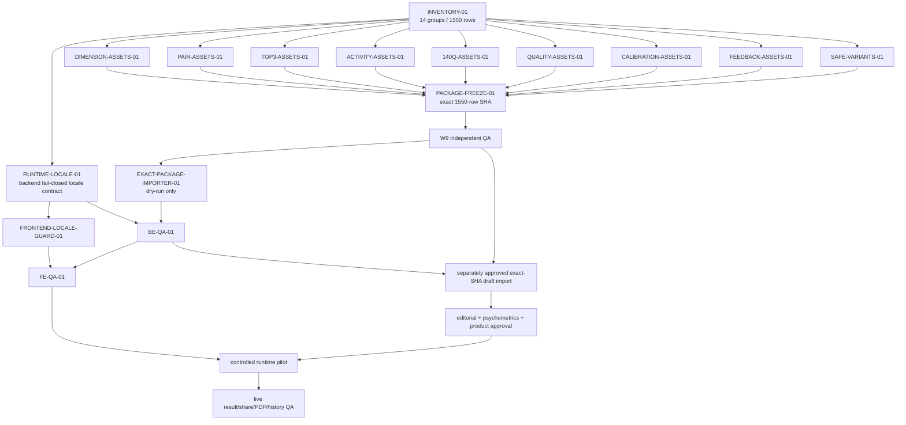

# W4 RIASEC English parity PR dependency DAG

Status: planning-only; W4 is `registered/not_started`. Every new execution node is on HOLD until the control window sets `launch_ready`.

## Decisions

| Candidate | Verdict | Reason |
|---|---|---|
| New slot/schema architecture | ALREADY_SATISFIED | Existing deep-slot schema is usable; locale-aware selection is the missing contract. |
| Locale-aware backend resolver | BLOCKED / required after launch | Current registry, activity, and feedback paths are zh-CN-only. |
| Nine producer segments | BLOCKED / required after launch | They cover all 1550 atomic rows without mixing reader content with runtime code. |
| 120 authored top3 assets | NOT_REQUIRED | Keep 20 authored unordered rows and deterministic ordered projection; extend QA to 120/120. |
| Generic external validator | ALREADY_SATISFIED | Existing Asset Agent and validator harness cover generic dry-run validation. |
| W4 exact-package dry-run mapping | BLOCKED | Requires frozen package and W9 PASS; zero writes. |
| Frontend locale guard | BLOCKED / required after backend contract | Defense-in-depth only; no frontend copy. |
| W9 QA | BLOCKED | W9 waits for the first frozen package and must remain independent. |
| Public SEO/indexability PR | NOT_REQUIRED | Private result/report/PDF/history remain noindex; no new public indexable surface. |

The DAG is acyclic. fap-web and fap-api changes are split into separate PRs. Reader content, runtime contract, importer, QA, import, approval, pilot, and live QA remain separate gates.
