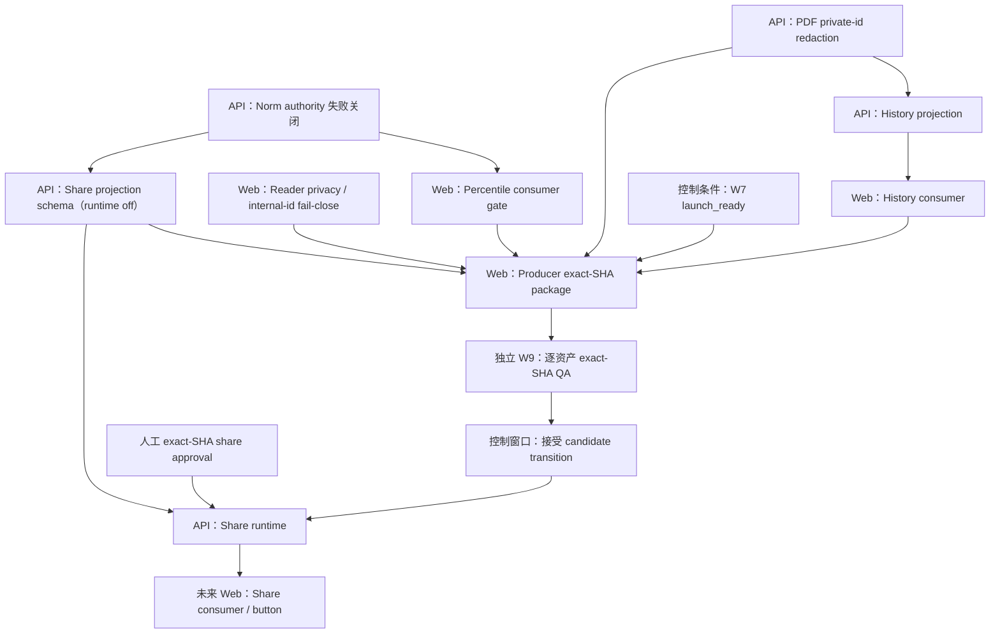

# W7 EQ English parity PR 依赖图

当前窗口只完成扫描，不执行下列 PR。扫描时 W7 仍是 `registered / not_started`；producer package 还额外要求控制面把 W7 置为 `launch_ready`。

## 推荐执行顺序

1. `EN-PARITY-W7-EQ-NORM-AUTHORITY-GATE-01`：第一个可执行 PR。它只建立 claim 失败关闭，不需要生产常模写权限。
2. 可并行执行 reader privacy 与 PDF privacy；机器并发护栏仍要求同一时间最多一套重型验证。
3. norm consumer、history projection/consumer、share schema 按依赖完成。
4. 只有 W7=`launch_ready` 且全部合同前置合并后，才冻结 producer package。
5. W9 必须独立审查 exact frozen SHA；producer 不能自审。
6. control window 只接受 exact-SHA candidate transition；不得把 QA、draft import、published、indexability 或 release 合并成一步。
7. share runtime 必须是后置独立 PR；前端分享启用还要再拆一个 consumer PR。

## 明确不在图中的工作

- 不新增付费 entitlement；EQ 当前是 full/free。
- 不重做 EQ V5 renderer、route matrix、fixture 或历史 smoke。
- 不启用 EQ-SJT。
- 不写 CMS、生产数据、sitemap、llms、indexability 或 public release。
- 不为当前 139 个 SEO/GEO 节点创建 W7 内容 PR。
